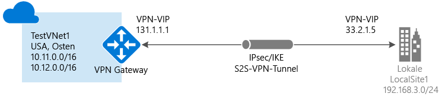

# Erstellen eines VNet mit einer Standort-zu-Standort-Verbindung über das klassische Portal

Eine VPN Gateway-S2S-Verbindung (Site-to-Site) ist eine Verbindung über einen VPN-Tunnel vom Typ „IPsec/IKE“ (IKEv1 oder IKEv2). Für diese Art von Verbindung wird ein lokales VPN-Gerät benötigt, dem eine öffentliche IP-Adresse zugewiesen ist und das nicht hinter einer NAT-Einheit angeordnet ist. Site-to-Site-Verbindungen können für standortübergreifende Konfigurationen und Hybridkonfigurationen verwendet werden.

In diesem Artikel werden das Erstellen eines virtuellen Netzwerks und das Herstellen einer Site-to-Site-VPN-Gatewayverbindung mit Ihrem lokalen Netzwerk mithilfe des klassischen Bereitstellungsmodells und des Azure-Portals beschrieben. Site-to-Site-Verbindungen können für standortübergreifende Konfigurationen und Hybridkonfigurationen verwendet werden. Sie können diese Konfiguration auch für das Resource Manager-Bereitstellungsmodell erstellen, indem Sie in der folgenden Liste eine andere Option wählen:

> [!div class="op_single_selector"]
> * [Resource Manager – Azure-Portal](vpn-gateway-howto-site-to-site-resource-manager-portal.md)
> * [Resource Manager – PowerShell](vpn-gateway-create-site-to-site-rm-powershell.md)
> * [Klassisch – Azure-Portal](vpn-gateway-howto-site-to-site-classic-portal.md)
> * [Klassisch – Klassisches Portal](vpn-gateway-site-to-site-create.md)
>
>

#### Zusätzliche Konfigurationen
Wenn Sie VNets miteinander verbinden möchten, helfen Ihnen die Informationen unter [Konfigurieren einer VNet-zu-VNet-Verbindung für das klassische Bereitstellungsmodell](virtual-networks-configure-vnet-to-vnet-connection.md)weiter. Wenn Sie eine Site-to-Site-Verbindung mit einem VNET hinzufügen möchten, das bereits über eine Verbindung verfügt, lesen Sie unter [Hinzufügen einer S2S-Verbindung mit einem VNET mit einer vorhandenen VPN-Gatewayverbindung](vpn-gateway-multi-site.md) nach.

## Voraussetzungen

[!INCLUDE [deployment models](../../includes/vpn-gateway-deployment-models-include.md)]

Vergewissern Sie sich vor Beginn der Konfiguration, dass Sie über Folgendes verfügen:

* Ein kompatibles VPN-Gerät (und eine Person, die es konfigurieren kann). Weitere Informationen finden Sie unter [Informationen zu VPN-Geräten](vpn-gateway-about-vpn-devices.md). Wenn Sie sich mit dem Konfigurieren des VPN-Geräts oder mit den IP-Adressbereichen Ihrer lokalen Netzwerkkonfiguration nicht auskennen, müssen Sie sich an eine Person wenden, die Ihnen diese Details liefern kann.
* Eine externe öffentliche IP-Adresse für Ihr VPN-Gerät. Diese IP-Adresse darf sich nicht hinter einer NAT befinden.
* Ein Azure-Abonnement. Wenn Sie noch kein Azure-Abonnement besitzen, können Sie Ihre [MSDN-Abonnentenvorteile](https://azure.microsoft.com/pricing/member-offers/msdn-benefits-details) aktivieren oder sich für ein [kostenloses Konto](https://azure.microsoft.com/pricing/free-trial) registrieren.

## Erstellen des virtuellen Netzwerks
1. Melden Sie sich beim [klassischen Azure-Portal](https://manage.windowsazure.com/)an.
2. Klicken Sie unten links auf dem Bildschirm auf **Neu**. Klicken Sie im Navigationsbereich auf **Network Services** und dann auf **Virtual Network**. Klicken Sie auf **Custom Create** , um den Konfigurationsassistenten zu starten.
3. Geben Sie zum Erstellen des VNet Ihre Konfigurationseinstellungen auf den folgenden Seiten ein:

## Seite „Details zu Virtual Network“
Geben Sie Folgendes ein:

* **Name**: Name des virtuellen Netzwerks. Beispiel: *EastUSVNet*. Sie verwenden den hier festgelegten Namen bei der Bereitstellung Ihrer VMs und PaaS-Instanzen. Deshalb sollte der Name nicht zu kompliziert sein.
* **Speicherort**: Der Speicherort steht in direkter Beziehung zu dem physischen Standort (Region), an dem sich Ihre Ressourcen (VMs) befinden sollen. Wenn Sie z.B. möchten, dass sich die virtuellen Computer, die Sie für Ihr virtuelles Netzwerk bereitstellen, physisch in der Region *USA, Osten* befinden, wählen Sie diesen Standort aus. Sie können die Ihrem virtuellen Netzwerk zugeordnete Region nach dem Erstellen nicht mehr ändern.

## Seite „DNS-Server und VPN-Konnektivität“
Geben Sie die folgenden Informationen ein, und klicken Sie dann unten rechts auf den Pfeil „Weiter“.

* **DNS-Server**: Geben Sie den Namen und die IP-Adresse des DNS-Servers ein, oder wählen Sie einen zuvor registrierten DNS-Server im Kontextmenü aus. Mit dieser Einstellung wird kein DNS-Server erstellt. Sie bietet die Möglichkeit, den DNS-Server anzugeben, den Sie zur Namensauflösung für dieses virtuelle Netzwerk verwenden möchten.
* **Site-to-Site-VPNs konfigurieren:** Aktivieren Sie das Kontrollkästchen **Ein Site-to-Site-VPN konfigurieren**.
* **Lokales Netzwerk:**Ein lokales Netzwerk stellt Ihren lokalen physischen Standort dar. Sie können ein zuvor erstelltes lokales Netzwerk auswählen oder ein neues lokales Netzwerk erstellen. Wenn Sie ein zuvor erstelltes lokales Netzwerk auswählen, sollten Sie aber auf der Konfigurationsseite **Lokale Netzwerke** sicherstellen, dass die IP-Adresse des VPN-Geräts (öffentliche IPv4-Adresse) stimmt.

## Seite „Site-to-Site-Konnektivität“
Wenn Sie ein neues lokales Netzwerk erstellen, wird die Seite **Site-to-Site-Konnektivität** angezeigt. Wenn Sie ein zuvor erstelltes lokales Netzwerk verwenden möchten, wird diese Seite nicht im Assistenten angezeigt, und Sie können mit dem nächsten Abschnitt fortfahren.

Geben Sie die folgenden Informationen ein, und klicken Sie dann auf den Pfeil "Weiter".

* **Name:**Der Name, den Sie Ihrem lokalen Netzwerkstandort geben möchten.
* **IP-Adresse des VPN-Geräts:**Die öffentliche IPv4-Adresse des lokalen VPN-Geräts, mit dem Sie die Verbindung mit Azure herstellen. Das VPN-Gerät kann sich nicht hinter einer NAT befinden.
* **Adressraum:**Umfasst die Start-IP und CIDR (Adressenanzahl). Sie geben die Adressbereiche an, die über das Gateway für das virtuelle Netzwerk an Ihren lokalen Standort gesendet werden sollen. Wenn eine IP-Zieladresse in die hier angegebenen Bereiche fällt, wird sie über das Gateway für das virtuelle Netzwerk geleitet.
* **Adressraum hinzufügen**: Wenn mehrere Adressbereiche über das Gateway für das virtuelle Netzwerk gesendet werden sollen, geben Sie alle zusätzlichen Adressbereiche an. Sie können die Bereiche später auf der Seite **Lokales Netzwerk** hinzufügen oder entfernen.

## Seite „Adressräume von Virtual Network“
Geben Sie den Adressbereich an, den Sie für Ihr virtuelles Netzwerk verwenden möchten. Dies sind die dynamischen IP-Adressen (DIPS), die den virtuellen Computern und anderen Rolleninstanzen zugewiesen werden, die Sie für dieses virtuelle Netzwerk bereitstellen.

Es ist besonders wichtig, einen Bereich auszuwählen, der sich nicht mit den anderen Bereichen überschneidet, die für Ihr lokales Netzwerk verwendet werden. Sprechen Sie sich mit Ihrem Netzwerkadministrator ab. Der Netzwerkadministrator muss ggf. einen Bereich von IP-Adressen aus dem Adressraum Ihres lokalen Netzwerks reservieren, den Sie für Ihr virtuelles Netzwerk verwenden können.

Geben Sie die folgenden Informationen ein, und klicken Sie dann auf das Häkchen in der unteren rechten Ecke, um Ihr Netzwerk zu konfigurieren.

* **Adressraum:**Umfasst die Start-IP und die Anzahl von Adressen. Stellen Sie sicher, dass sich die angegebenen Adressräume und die Adressräume im lokalen Netzwerk nicht überschneiden.
* **Subnetz hinzufügen:**Umfasst die Start-IP und die Anzahl von Adressen. Zusätzliche Subnetze sind nicht erforderlich, aber Sie können eine getrenntes Subnetz für virtuelle Computer erstellen, die über statische DIPs verfügen sollen. Vielleicht möchten Sie jedoch auch Ihre virtuellen Computer in einem Subnetz zusammenfassen, das von Ihren anderen Rolleninstanzen getrennt ist.
* **Gatewaysubnetz hinzufügen:**Klicken Sie auf diese Option, um das Gatewaysubnetz hinzuzufügen. Das Gatewaysubnetz wird nur für das Gateway des virtuellen Netzwerks verwendet und ist für diese Konfiguration erforderlich.

Klicken Sie auf das Häkchen am rechten unteren Rand der Seite, damit das virtuelle Netzwerk erstellt wird. Sobald der Vorgang abgeschlossen ist, wird im klassischen Azure-Portal auf der Seite **Netzwerke** unter **Status** der Eintrag **Erstellt** angezeigt. Nachdem das VNet erstellt wurde, können Sie Ihr Gateway für das virtuelle Netzwerk konfigurieren.

[!INCLUDE [vpn-gateway-no-nsg](../../includes/vpn-gateway-no-nsg-include.md)]

## Konfigurieren des Gateways für das virtuelle Netzwerk
Konfigurieren Sie das Gateway für das virtuelle Netzwerk, um eine sichere Site-to-Site-Verbindung zu erstellen. Weitere Informationen finden Sie unter [Konfigurieren eines Gateways für ein virtuelles Netzwerk im klassischen Azure-Portal](vpn-gateway-configure-vpn-gateway-mp.md).

## Nächste Schritte
 Sobald die Verbindung hergestellt ist, können Sie Ihren virtuellen Netzwerken virtuelle Computer hinzufügen. Weitere Informationen finden Sie unter [Virtuelle Computer](https://docs.microsoft.com/azure/#pivot=services&panel=Compute) .

