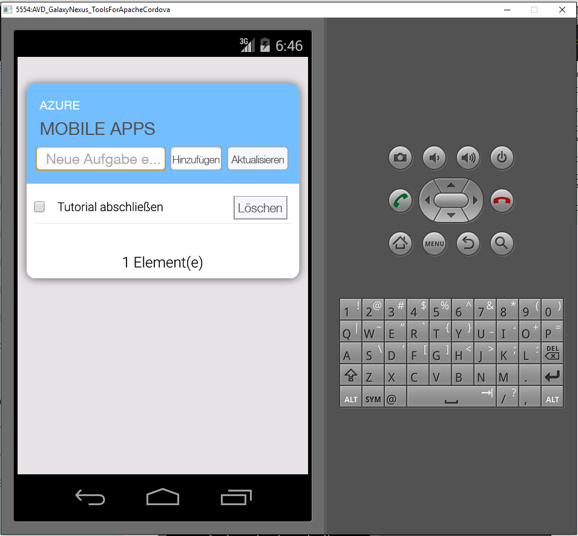

1. Besuchen Sie das [Azure-Portal]. Klicken Sie auf **Alle durchsuchen** > **Mobile Apps** > Back-End, das Sie gerade erstellt haben. Klicken Sie in den Einstellungen der mobilen App auf **Schnellstart** > **Cordova**. Klicken Sie unter **Clientanwendung konfigurieren**, auf **Neue App erstellen**, und klicken Sie dann auf **Download**. Damit laden Sie ein vollständiges Cordova-Projekt für eine App herunter, das für eine Verbindung mit dem Back-End vorkonfiguriert ist.

2. Entpacken Sie die heruntergeladene ZIP-Datei in ein Verzeichnis auf Ihrer Festplatte, navigieren Sie zur Projektmappendatei (SLN-Datei), und öffnen Sie sie in Visual Studio.

5. Wählen Sie in Visual Studio in der Dropdownliste neben dem Startpfeil die Plattform für die Projektmappe (Android, iOS oder Windows) und anschließend ein bestimmtes Bereitstellungsgerät oder einen Emulator aus, indem Sie auf die Dropdownliste mit dem grünen Pfeil klicken. Sie können die standardmäßig ausgewählte Android-Plattform und den Ripple-Emulator verwenden. In komplexeren Tutorials muss ein unterstütztes Gerät oder ein unterstützter Emulator ausgewählt werden.

6. Drücken Sie F5, oder klicken Sie auf den grünen Pfeil, um Ihre Cordova-App zu erstellen und auszuführen. Sollte im Emulator ein Sicherheitsdialogfeld mit einer Netzwerkzugriffsanforderung angezeigt werden, lassen Sie den Zugriff zu.

7. Nachdem die App auf dem Gerät oder im Emulator gestartet wurde, geben Sie unter **Enter new text** (Neuen Text eingeben) einen aussagekräftigen Text ein (etwa _Tutorial abschließen_), und klicken Sie dann auf die Schaltfläche **Hinzufügen**. Damit wird eine POST-Anforderung an das Azure-Back-End gesendet, das Sie zuvor bereitgestellt haben. Das Back-End fügt Daten aus der Anforderung in die TodoItem-Tabelle in SQL-Datenbank ein und gibt Informationen zu den neu gespeicherten Elementen an die mobile App zurück. Die mobile App zeigt diese Daten in der Liste an.

    
    
8. Wiederholen Sie die drei oben aufgeführten Schritte für jede Geräteplattform, die Sie unterstützen möchten.

[Azure-Portal]: https://portal.azure.com/

<!---HONumber=AcomDC_0817_2016-->