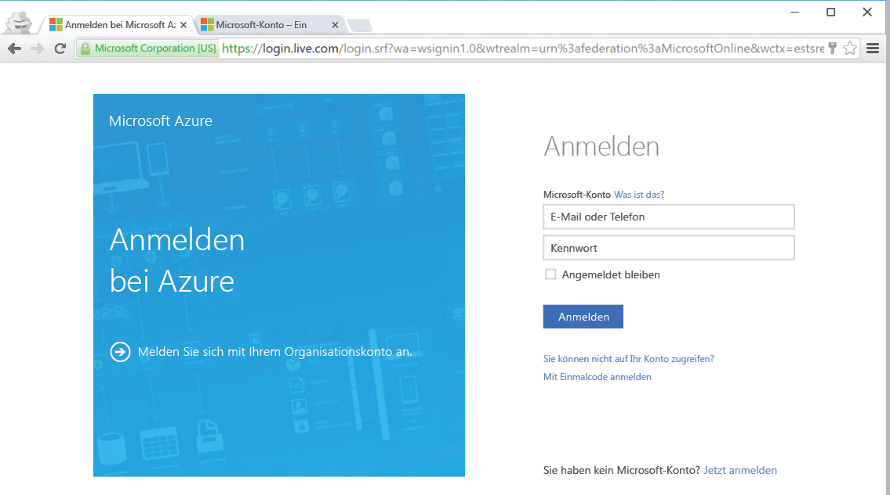

<!--
includes/azure-include-getting-started-v12portal-gettings-an-account.md

Latest Freshness check:  2016-04-11 , carlrab.

As of circa 2016-04-11, the following topics might include this include:
articles/sql-database/sql-database-get-started-tutorial.md

-->
## Herstellen einer Verbindung mit dem Microsoft Azure-Portal mit einem Abonnement

Zum Herstellen einer Verbindung mit dem Microsoft Azure-Portal benötigen Sie ein Abonnement.

### Einrichten eines neuen Kontos

Falls Sie noch nicht über ein Microsoft Azure-Konto verfügen, verwenden Sie einen der folgenden Links, um ein Konto zu erhalten:

- [Kostenloses Konto erhalten](https://azure.microsoft.com/get-started/)
- [MSDN-Abonnement verwenden](https://azure.microsoft.com/pricing/member-offers/msdn-benefits/)

###Melden Sie sich mit Ihrem Konto an.

Führen Sie die folgenden Schritte aus, um unter Verwendung Ihres [bereits vorhandenen Abonnements](https://account.windowsazure.com/Home/Index) eine Verbindung mit dem Azure-Portal herzustellen.

1. Öffnen Sie einen Browser Ihrer Wahl, und stellen Sie unter http://portal.azure.com/ eine Verbindung mit dem [Azure-Portal](https://portal.azure.com/) her.

1. Melden Sie sich unter http://portal.azure.com/ beim [Azure-Portal](https://portal.azure.com/) an.

1. Geben Sie auf der Anmeldeseite die Anmeldeinformationen für Ihr Abonnement ein.

   
   

<!---HONumber=AcomDC_0413_2016-->