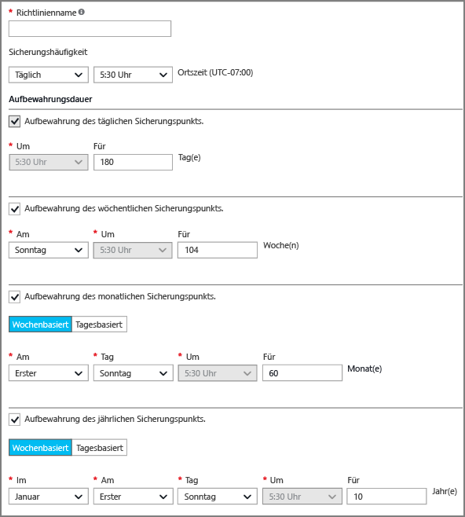
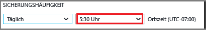
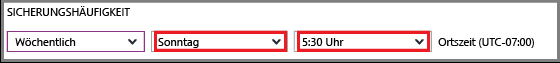

## Definieren einer Sicherungsrichtlinie
Mit einer Sicherungsrichtlinie wird eine Matrix dafür definiert, wann Datenmomentaufnahmen erstellt werden und wie lange diese Momentaufnahmen aufbewahrt werden. Wenn Sie eine Richtlinie zum Sichern eines virtuellen Computers definieren, können Sie einen Sicherungsauftrag *einmal pro Tag*auslösen. Wenn Sie eine neue Richtlinie erstellen, wird sie auf den Tresor angewendet. Die Oberfläche für die Sicherungsrichtlinie sieht wie folgt aus:

So erstellen Sie eine Richtlinie

1. Geben Sie einen Namen für die **Richtlinie**ein.
2. Sie können in täglichen oder wöchentlichen Abständen Momentaufnahmen Ihrer Daten erstellen. Wählen Sie im Dropdownmenü **Sicherungshäufigkeit** aus, ob Momentaufnahmen der Daten täglich oder wöchentlich erstellt werden sollen.
   
   * Wenn Sie als Intervall „Täglich“ auswählen, können Sie das hervorgehobene Steuerelement verwenden, um die Tageszeit für die Momentaufnahme auszuwählen. Deaktivieren Sie zum Ändern der Stundenangabe die vorhandene Stunde, und wählen Sie dann die neue Stunde aus.
     
       
   * Verwenden Sie bei Auswahl des Intervalls „Wöchentlich“ die hervorgehobenen Steuerelemente, um die Wochentage und die Uhrzeit für die Erstellung der Momentaufnahme auszuwählen. Wählen Sie im Menü „Tag“ einen oder mehrere Tage aus. Wählen Sie im Menü „Stunde“ eine Stunde aus. Deaktivieren Sie zum Ändern der Stundenangabe die ausgewählte Stunde, und wählen Sie dann die neue Stunde aus.
     
     
3. Standardmäßig sind alle Optionen unter **Beibehaltungsdauer** aktiviert. Deaktivieren Sie alle einschränkenden Optionen für die Beibehaltungsdauer, die Sie nicht verwenden möchten. Geben Sie dann die zu verwendenden Intervalle an.
   
    Mit monatlichen und jährlichen Beibehaltungsdauern können Sie die Momentaufnahmen basierend auf einem wöchentlichen oder täglichen Inkrement angeben.
   
   > [!NOTE]
   > Wenn eine VM geschützt wird, wird einmal pro Tag ein Sicherungsauftrag ausgeführt. Der Zeitpunkt, zu dem die Sicherung ausgeführt wird, ist für jede Beibehaltungsdauer gleich.
   > 
   > 
4. Nachdem Sie alle Optionen für die Richtlinie festgelegt haben, klicken Sie oben auf dem Blatt auf **Speichern**.
   
    Die neue Richtlinie wird sofort auf den Tresor angewendet.

