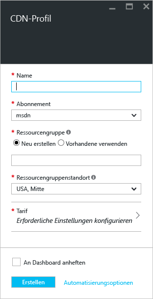
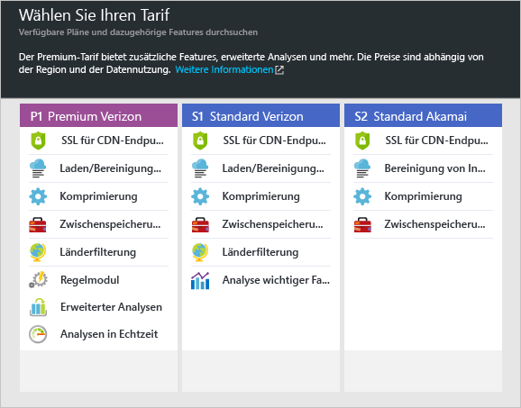

**So erstellen Sie ein neues CDN-Profil**

1. Klicken Sie im [Azure-Portal](https://portal.azure.com)oben links auf **Neu**.  Wählen Sie auf dem Blatt **Neu** erst **Web und mobil** und dann **CDN** aus.
   
    Das Blatt für das neue CDN-Profil wird angezeigt.
   
    
2. Geben Sie einen Namen für das CDN-Profil ein.
3. Wählen Sie einen **Speicherort**aus.  Dies ist der Azure-Speicherort, an dem Ihre CDN-Profilinformationen gespeichert werden.  Dies hat keine Auswirkung auf die Speicherorte von CDN-Endpunkten.
4. Wählen Sie eine **Ressourcengruppe**aus, oder erstellen Sie eine.  Weitere Informationen zu Ressourcengruppen finden Sie unter [Übersicht über Azure Resource Manager](../articles/azure-resource-manager/resource-group-overview.md#resource-groups).
5. Wählen Sie einen **Tarif**aus.  Einen Vergleich der Tarife finden Sie unter [Übersicht über CDN](../articles/cdn/cdn-overview.md#azure-cdn-features).
   
    
6. Wählen Sie das **Abonnement** für dieses CDN-Profil aus.
7. Klicken Sie auf die Schaltfläche **Erstellen** , um das neue Profil zu erstellen. 

