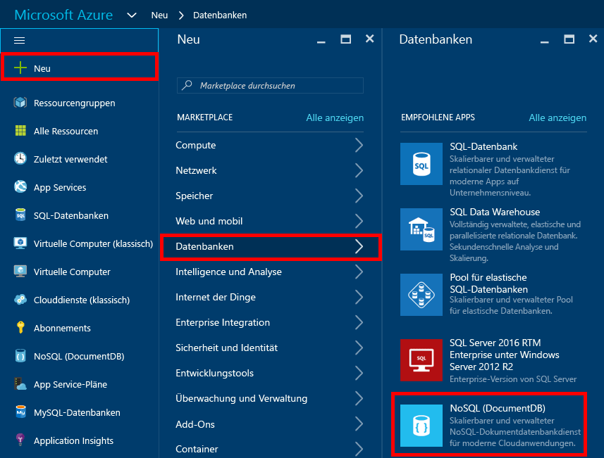
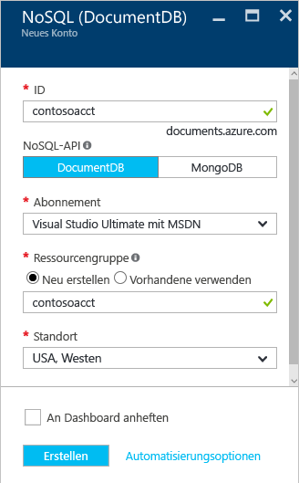
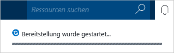
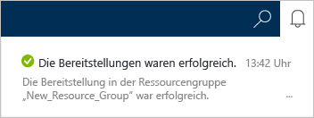
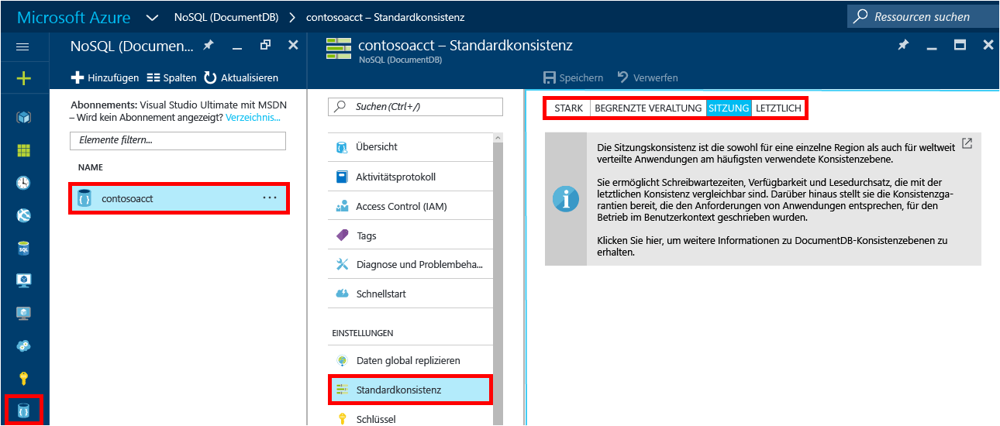

1. Melden Sie sich in einem neuen Fenster beim [Azure-Portal](https://portal.azure.com/) an.
2. Klicken Sie im Navigationsbereich auf **Neu**, dann auf **Datenbanken** und anschließend auf **NoSQL (DocumentDB)**.
   
     
3. Legen Sie auf dem Blatt **Neues Konto** die gewünschte Konfiguration für das DocumentDB-Konto fest.
   
    
   
   * Geben Sie im Feld **ID** einen Namen zur Identifizierung des DocumentDB-Kontos ein.  Nachdem die **ID** überprüft wurde, wird im Feld **ID** ein grünes Häkchen angezeigt. Der Wert von **ID** wird zum Hostnamen im URI. Die **ID** darf nur Kleinbuchstaben, Ziffern und den Bindestrich "-" enthalten und muss zwischen 3 und 50 Zeichen lang sein. Beachten Sie, dass *documents.azure.com* an den von Ihnen ausgewählten Endpunktnamen angehängt wird. Der Name mit diesem Zusatz wird zu Ihrem DocumentDB-Kontoendpunkt.
   * Wählen Sie **DocumentDB** im Feld **NoSQL-API**.  
   * Wählen Sie unter **Abonnement**das Azure-Abonnement aus, das Sie mit dem DocumentDB-Konto verwenden möchten. Wenn Ihr Konto nur über ein Abonnement verfügt, wird standardmäßig dieses Konto ausgewählt.
   * Unter **Ressourcengruppe**können Sie eine Ressourcengruppe für Ihr DocumentDB-Konto auswählen oder erstellen.  Standardmäßig wird eine neue Ressourcengruppe erstellt. Weitere Informationen finden Sie unter [Verwalten von Azure-Ressourcen über das Portal](../articles/azure-portal/resource-group-portal.md).
   * Unter **Standort** können Sie einen geografischen Standort angeben, an dem Ihr DocumentDB-Konto gehostet wird. 
4. Klicken Sie nach der Konfiguration der Optionen für das neue DocumentDB-Konto auf **Erstellen**. Der Status der Bereitstellung kann im Benachrichtigungs-Hub überprüft werden.  
   
     
   
   
5. Nachdem das DocumentDB-Konto erstellt wurde, steht es mit den Standardeinstellungen zur Verfügung. Klicken Sie zum Überprüfen der Standardeinstellungen im Navigationsbereich auf das Symbol **NoSQL (DocumentDB)**, klicken Sie auf Ihr neues Konto, und klicken Sie anschließend im Ressourcenmenü auf **Standardkonsistenz**.

     

   Die Standardkonsistenz des DocumentDB-Kontos ist auf **Sitzung**festgelegt.  Sie können die Standardkonsistenz anpassen, indem Sie eine der anderen verfügbaren Konsistenzoptionen auswählen. Weitere Informationen zu den Konsistenzebenen von DocumentDB finden Sie unter [Konsistenzebenen in DocumentDB](../articles/documentdb/documentdb-consistency-levels.md).

[How to: Create a DocumentDB account]: #Howto
[Next steps]: #NextSteps
[documentdb-manage]:../articles/documentdb/documentdb-manage.md

<!--HONumber=Feb17_HO1-->

