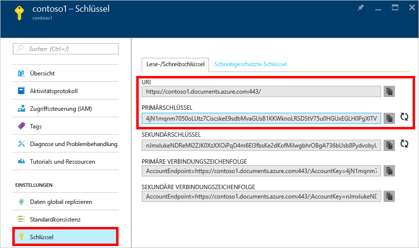

  Navigieren Sie nun zum Blatt „DocumentDB-Konto“, und klicken Sie auf **Schlüssel**, da wird diese Werte in der Webanwendung verwenden, die wir als Nächstes erstellen.

<!---HONumber=AcomDC_0914_2016-->