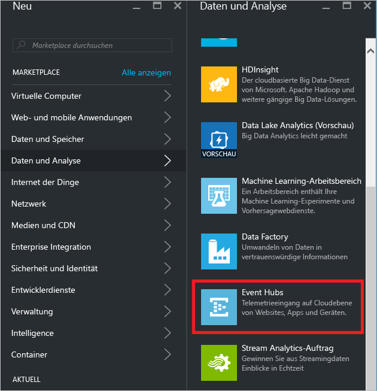
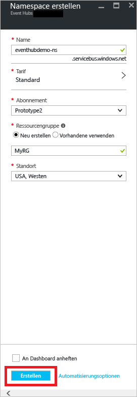
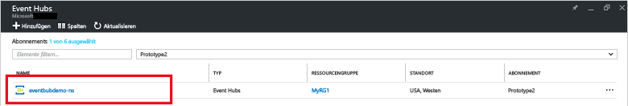
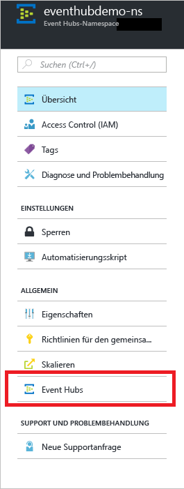
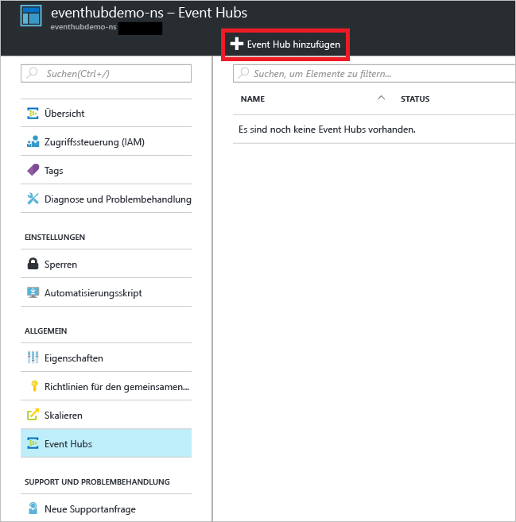
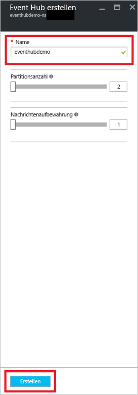
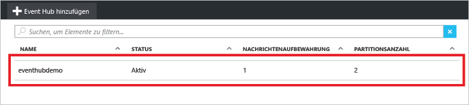
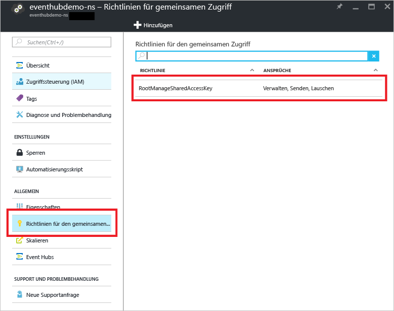
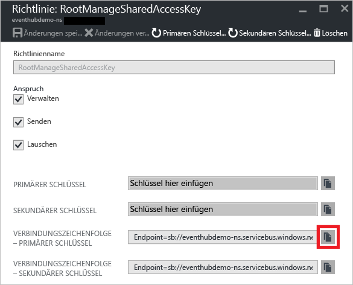

## Erstellen eines Ereignis-Hubs

1. Melden Sie sich beim [Azure-Portal][] an, und klicken Sie oben links auf dem Bildschirm auf **Neu**.

2. Klicken Sie auf **Daten + Analysen** und anschließend auf **Event Hubs**.

	

3. Geben Sie auf dem Blatt **Namespace erstellen** einen Namen für den Namespace ein. Das System überprüft sofort, ob dieser Name verfügbar ist.

	

4. Ist der Name verfügbar, wählen Sie den Tarif („Basic“ oder „Standard“) aus. Wählen Sie außerdem ein Azure-Abonnement, eine Ressourcengruppe und einen Standort, an dem die Ressource erstellt werden soll.

2. Klicken Sie auf **Erstellen**, um den Namespace zu erstellen.

6. Klicken Sie in der Liste der Event Hubs-Namespaces auf den neu erstellten Namespace.

	

7. Klicken Sie auf dem Blatt mit den Namespaces auf **Event Hubs**.

	

8. Klicken Sie oben auf dem Blatt auf **Event Hub hinzufügen**.

	

3. Geben Sie einen Namen für den Event Hub ein, und klicken Sie auf **Erstellen**.

	

4. Klicken Sie in der Liste der Event Hubs auf den Namen des neu erstellten Event Hubs.

	

5. Klicken Sie auf dem Blatt mit Namespaces (nicht auf dem Blatt für den bestimmten Event Hub) auf **Shared access policies** (Richtlinien für gemeinsamen Zugriff), und klicken Sie dann auf **RootManageSharedAccessKey**.

	

5. Klicken Sie auf die Kopierschaltfläche, um die Verbindungszeichenfolge **RootManageSharedAccessKey** in die Zwischenablage zu kopieren. Speichern Sie diese Verbindungszeichenfolge für die spätere Verwendung in diesem Tutorial.

	

Ihr Event Hub wird jetzt erstellt, und Sie verfügen über die zum Senden und Empfangen von Ereignissen erforderlichen Verbindungszeichenfolgen.

[Azure-Portal]: https://portal.azure.com/

<!---HONumber=AcomDC_0921_2016-->