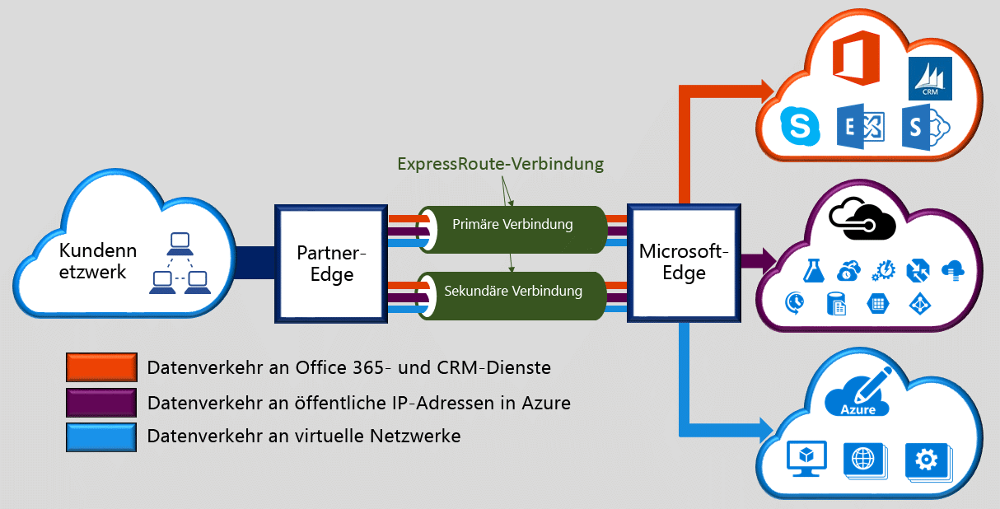

Mit Microsoft Azure ExpressRoute können Sie Ihre lokalen Netzwerke über eine dedizierte private Verbindung, die von einem Konnektivitätsanbieter bereitgestellt wird, in die Microsoft Cloud erweitern. Mit ExpressRoute können Sie Verbindungen mit Microsoft-Clouddiensten herstellen, z. B. Microsoft Azure, Office 365 und CRM Online. Die Konnektivität kann über ein Any-to-Any-Netzwerk (IP VPN), ein Point-to-Point-Ethernet-Netzwerk oder eine virtuelle Querverbindung über einen Konnektivitätsanbieter in einer Co-Location-Einrichtung bereitgestellt werden. ExpressRoute-Verbindungen verlaufen nicht über das öffentliche Internet. Auf diese Weise können ExpressRoute-Verbindungen eine höhere Sicherheit, größere Zuverlässigkeit und schnellere Geschwindigkeit bei geringerer Latenz als herkömmliche Verbindungen über das Internet bieten.

<!---HONumber=AcomDC_0727_2016-->