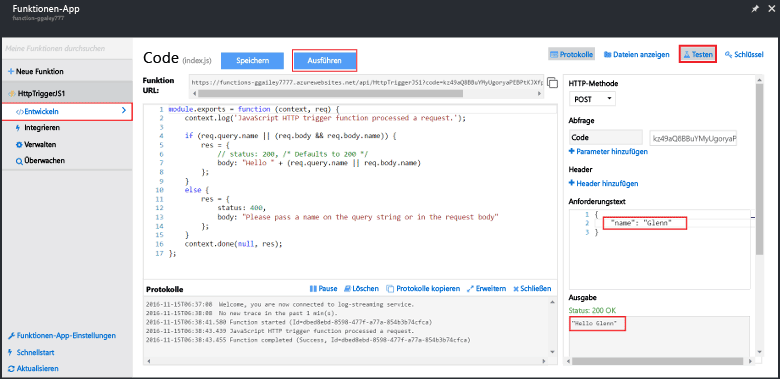

Da der Schnellstart von Azure Functions Funktionscode enthält, können Sie Ihre neue Funktion sofort testen.

1. Sehen Sie sich auf der Registerkarte **Entwickeln** das Fenster **Code** an. Es fällt auf, dass für den bereitgestellten Code eine HTTP-Anforderung mit einem Wert für *Name* erforderlich ist, der entweder im Nachrichtentext oder in einer Abfragezeichenfolge übergeben wird. Wenn die Funktion ausgeführt wird, wird dieser Wert in der Antwortnachricht zurückgegeben. Das Beispiel unten ist eine JavaScript-Funktion.
   
2. Klicken Sie auf **Testen**, um den integrierten HTTP-Anforderungstestbereich für die Funktion anzuzeigen.
 
    

3. Legen Sie im Textfeld **Anforderungstext** den Wert der Eigenschaft *name* auf Ihren Namen fest, und klicken Sie anschließend auf **Ausführen**. Die Ausführung wird durch eine HTTP-Testanforderung ausgelöst, Informationen werden in die Protokolle geschrieben, und die Antwort „hello...“ wird in der **Ausgabe** angezeigt. 

4. Wenn Sie die Ausführung der gleichen Funktion über ein HTTP-Testtool oder in einem anderen Browserfenster auslösen möchten, kopieren Sie auf der Registerkarte **Entwickeln** den Wert für **Funktions-URL**, und fügen Sie ihn in das Tool oder in die Adressleiste des Browsers ein. Hängen Sie anschließend den Abfragezeichenfolgewert `&name=yourname` an, und führen Sie die Anforderung aus. Beachten Sie, dass die gleichen Informationen in die Protokolle geschrieben werden und der Text der Antwortnachricht die gleiche Zeichenfolge enthält.

    
