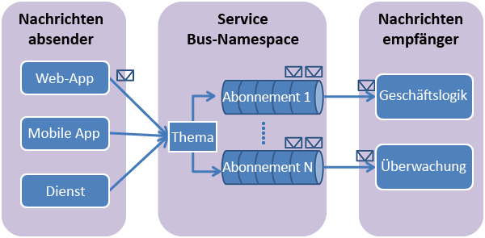

## Was sind Service Bus-Themen und -Abonnements?

Service Bus-Themen und -Abonnements unterstützen ein Modell der Messagingkommunikation über das *Veröffentlichen/Abonnieren*. Bei der Verwendung von Themen und Abonnements kommunizieren die Komponenten einer verteilten Anwendung nicht direkt miteinander, sondern tauschen Nachrichten über ein Thema aus, das als Zwischenstufe fungiert.

Im Gegensatz zu Service Bus-Warteschlangen, bei denen jede Nachricht von einem einzelnen Consumer verarbeitet wird, bieten Themen und Abonnements eine 1:n-Kommunikationsform, die nach dem Muster „Veröffentlichen/Abonnieren“ abläuft. Es ist möglich, mehrere Abonnements zu einem Thema anzumelden. Wenn eine Nachricht an ein Thema gesendet wird, steht sie in jedem Abonnement zur Verfügung, wo sie unabhängig von den anderen Abonnements verarbeitet wird.

Ein Themenabonnement ähnelt einer virtuellen Warteschlange, die Kopien der Nachrichten enthält, die an das Thema gesendet wurden. Sie können optional auch Filterregeln für einzelne Abonnements eines Themas anmelden. Auf diese Weise können Sie filtern oder einschränken, welche Nachrichten an ein Thema von welchen Themenabonnements empfangen werden.

Mit Service Bus-Themen und -Abonnements können Sie sehr viele Nachrichten an sehr viele Benutzer und Anwendungen verarbeiten.

## Erstellen eines Namespace

Um mit der Verwendung von Service Bus-Themen und -Abonnements in Azure beginnen zu können, müssen Sie zuerst einen *Dienstnamespace* erstellen. Ein Namespace ist ein Bereichscontainer für die Adressierung von Service Bus-Ressourcen innerhalb Ihrer Anwendung.

So erstellen Sie einen Namespace

1. Melden Sie sich beim [Azure-Portal][] an.

2. Klicken Sie im linken Navigationsbereich des Portals auf **Neu** > **Enterprise Integration** > **Service Bus**.

4. Geben Sie im Dialogfeld **Namespace erstellen** einen Namen für den Namespace ein. Das System überprüft sofort, ob dieser Name verfügbar ist.

5. Ist der Name verfügbar, wählen Sie den Tarif („Basic“, „Standard“ oder Premium“) aus.

7. Wählen Sie im Feld **Abonnement** ein Azure-Abonnement aus, in dem der Namespace erstellt werden soll.

9. Wählen Sie im Feld **Ressourcengruppe** eine vorhandene Ressourcengruppe für den Namespace aus, oder erstellen Sie eine neue Ressourcengruppe.

8. Wählen Sie im Feld **Standort** das Land oder die Region aus, in dem bzw. in der Ihr Namespace gehostet werden soll.

	![Erstellen des Namespaces][create-namespace]

6. Klicken Sie auf die Schaltfläche **Erstellen**. Ihr Dienstnamespace wird nun erstellt und aktiviert. Ggf. müssen Sie einige Minuten warten, bis die Ressourcen für Ihr Konto durch das System bereitgestellt werden.
 
### Abrufen der Anmeldeinformationen

1. Klicken Sie in der Liste mit den Namespaces auf den neu erstellten Namespacenamen.
 
3. Klicken Sie auf dem Blatt **Service Bus-Namespace** auf **Richtlinien für gemeinsamen Zugriff**.

4. Klicken Sie auf dem Blatt **Richtlinien für gemeinsamen Zugriff** auf **RootManageSharedAccessKey**.

	![connection-info][connection-info]

5. Klicken Sie auf dem Blatt **Richtlinie: RootManageSharedAccessKey** neben **Verbindungszeichenfolge – Primärschlüssel** auf die Kopierschaltfläche, um die Verbindungszeichenfolge zur späteren Verwendung in die Zwischenablage zu kopieren.

	![connection-string][connection-string]

[Azure-Portal]: https://portal.azure.com
[create-namespace]: ./media/howto-service-bus-topics/create-namespace.png
[connection-info]: ./media/howto-service-bus-topics/connection-info.png
[connection-string]: ./media/howto-service-bus-topics/connection-string.png

<!---HONumber=AcomDC_0824_2016-->