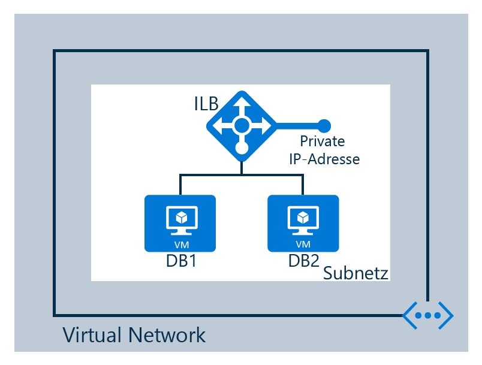

## Szenario

Sie erstellen einen internen Lastenausgleich gemäß dem folgenden Szenario

Ein interner Load Balancer ist in einem virtuellen Netzwerk konfiguriert.

* Zwei virtuelle Computer namens DB1 und DB2
* Endpunkte
* Interner Lastenausgleich
