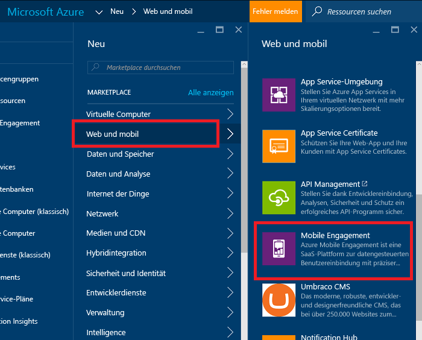
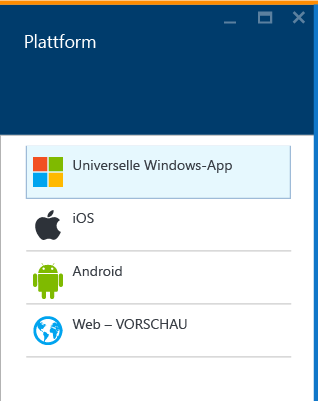
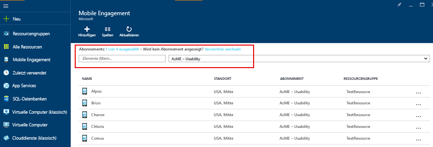
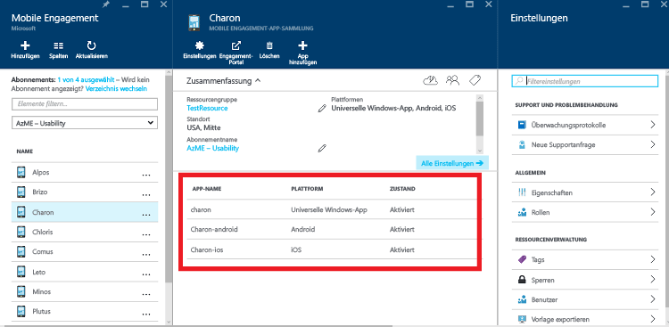
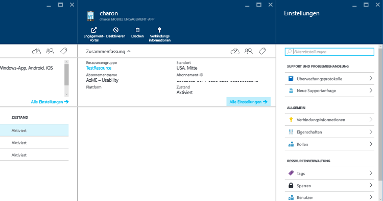

1. Melden Sie sich beim [Azure-Portal](https://portal.azure.com)an.
2. Klicken Sie auf **Neu** und dann auf **Web und mobil** und **Mobile Engagement**.
   
    
3. Im angezeigten Blatt **New Mobile Engagement App Collection** (Neue Mobile Engagement-App-Sammlung) erstellen Sie eine App-Sammlung, anstatt wie im klassischen Azure-Portal eine App. Geben Sie Folgendes ein:
   
    
   
   * **Name**: Dies ist der Name Ihrer *Anwendungssammlung* 
   * **Plattformen**: Wählen Sie auf dem daraufhin geöffneten Blatt „Plattformen“ die Zielplattformen für Ihre App aus. Beispiel: Wenn Sie eine App für iOS und Android erstellen möchten, wählen Sie beide Plattformen aus. Unter dieser App-Sammlung werden dann zwei Apps erstellt. 
     
      
   * **Abonnement**: Wählen Sie das Azure-Abonnement aus. 
   * **Ressourcengruppe**: Wählen Sie die Azure-Ressourcengruppe aus, in der diese Azure-Ressource (Mobile Engagement-App-Sammlung) enthalten sein soll. Sie können auch angeben, dass Sie eine neue Ressourcengruppe erstellen möchten.  
   * **Standort**: Dies ist die Region, in der die Daten zu dieser App-Sammlung und App gespeichert werden.
4. Navigieren Sie durch die Mobile Engagement-App-Sammlungen, indem Sie auf **Durchsuchen** klicken und nach **Mobile Engagement** suchen.
   
    
5. Eine Liste der Mobile Engagement-App-Sammlungen wird angezeigt. Stellen Sie sicher, dass Sie das gleiche Azure-Abonnement verwenden, in dem Sie auch die App-Sammlung erstellt haben.
   
    
6. Klicken Sie auf die im vorherigen Schritt erstellte App-Sammlung, um das Blatt mit den Ressourcen der App-Sammlung zu öffnen. Im Blatt werden die verschiedenen Apps angezeigt, die in der App-Sammlung enthalten sind. 
   
    
7. Klicken Sie auf die App für die Plattform, für die Sie die Entwicklung durchführen. 
   
    
8. Klicken Sie oben auf die Befehlsschaltfläche **Verbindungsinformationen** , um das Blatt „Verbindungsinformationen“ zu öffnen, und kopieren Sie die Verbindungszeichenfolge. 
   
    

