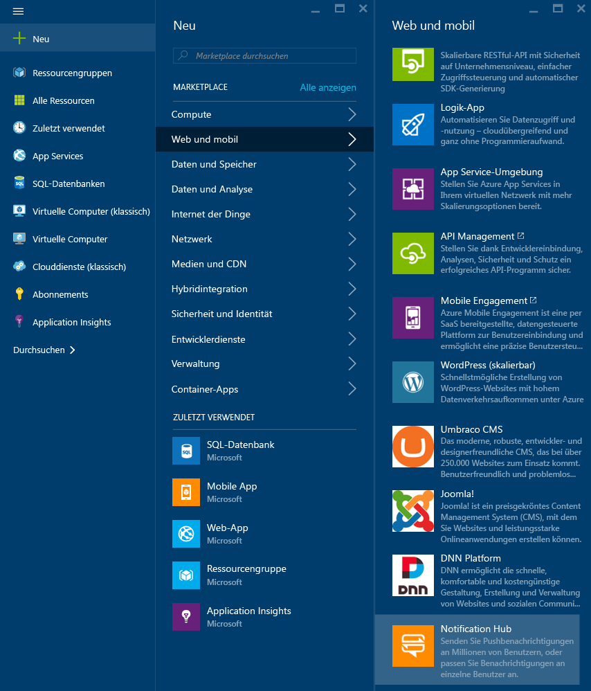
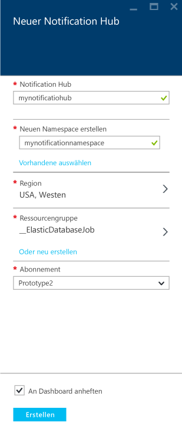
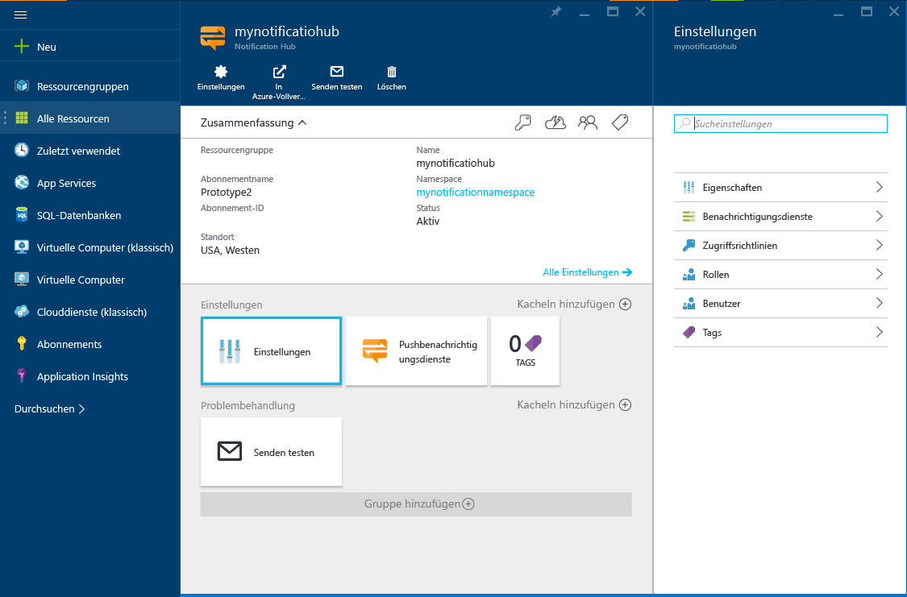
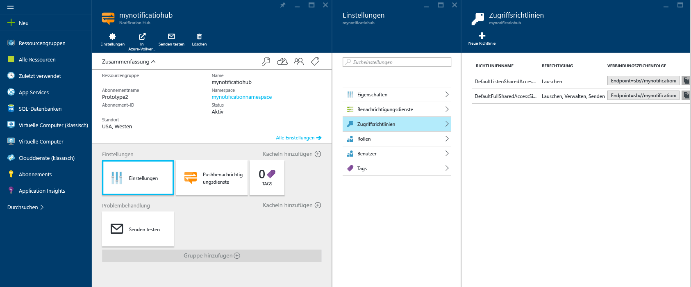

1. Melden Sie sich beim [Azure-Portal](https://portal.azure.com) an, und klicken Sie oben links auf dem Bildschirm auf **+NEU**.

2. Klicken Sie auf **Neu** und anschließend auf **Web und mobil**. Führen Sie ggf. einen Bildlauf nach unten aus, und klicken Sie auf **Notification Hub**.

   	

3. Achten Sie darauf, im Feld **Notification Hub** einen eindeutigen Namen einzugeben. Wählen Sie Ihre bevorzugte **Region**, das **Abonnement** und die **Ressourcengruppe** (sofern bereits vorhanden) aus.
 
	Wenn Sie bereits über einen Service Bus-Namespace verfügen, in dem Sie den Hub erstellen möchten, wählen Sie ihn über die Option **Vorhandene auswählen** im Feld **Namespace** aus. Andernfalls können Sie den standardmäßigen Namen verwenden, der basierend auf dem Hubnamen erstellt wird, solange der Namespacename verfügbar ist.

	Sobald Sie fertig sind, klicken Sie auf **Erstellen**.

   	

4. Sobald der Namespace und der Notification Hub erstellt sind, werden Sie zur entsprechenden Portalseite weitergeleitet.

   	
       
5. Klicken Sie auf **Einstellungen** und **Zugriffsrichtlinien**. Notieren Sie die beiden Verbindungszeichenfolgen, die Ihnen zur Verfügung gestellt werden, da Sie diese später zum Behandeln von Pushbenachrichtigungen benötigen.

   	

<!---HONumber=AcomDC_0413_2016-->