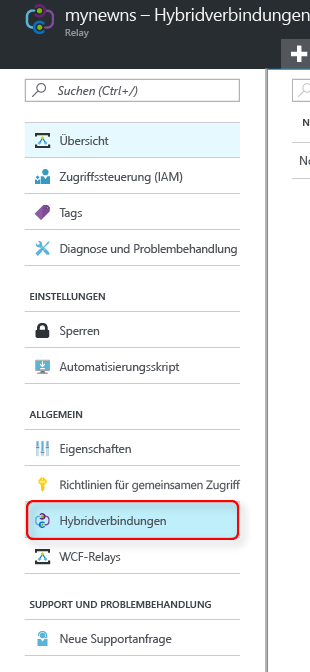
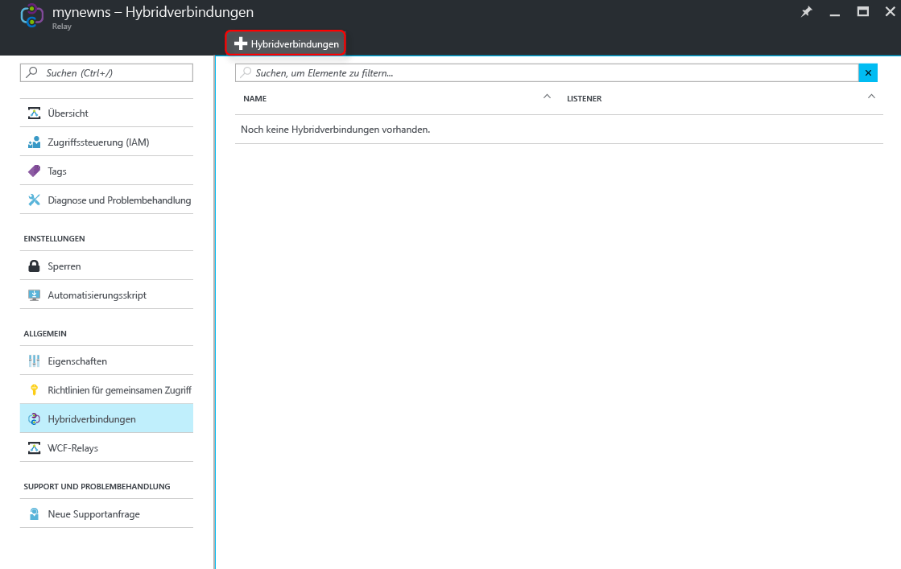
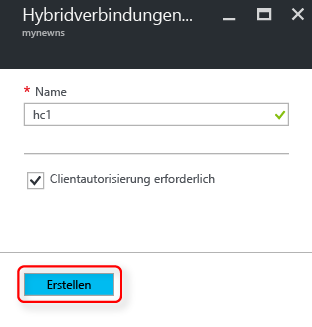

Vergewissern Sie sich, dass Sie bereits wie [hier][namespace-how-to] gezeigt einen Relay-Namespace erstellt haben.

1. Melden Sie sich beim [Azure-Portal](https://portal.azure.com)an.
2. Klicken Sie im linken Navigationsbereich des Portals auf **Relay**.
3. Wählen Sie den Namespace aus, in dem die Hybridverbindung erstellt werden soll. In diesem Fall: **mynewns**.
   
    
4. Wählen Sie auf dem Blatt **Relay-Namespace** die Option **Hybridverbindungen** aus, und klicken Sie dann auf **+ Hybridverbindung**.
   
    
5. Geben Sie den **Namen der Hybridverbindung ein**, und lassen Sie die anderen Werte unverändert.
   
    
6. Klicken Sie im unteren Bereich des Blatts auf **Erstellen**.

[namespace-how-to]: ../articles/service-bus-relay/relay-create-namespace-portal.md 