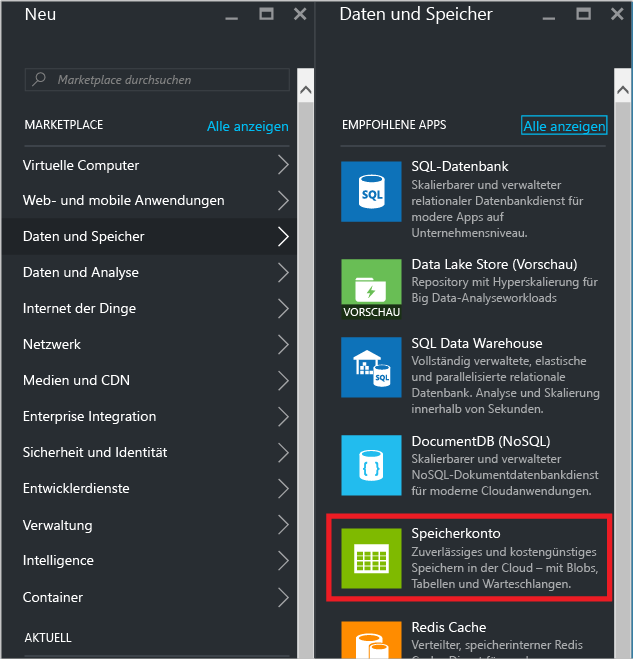
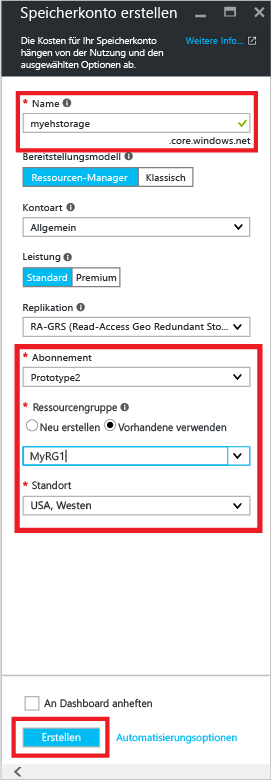
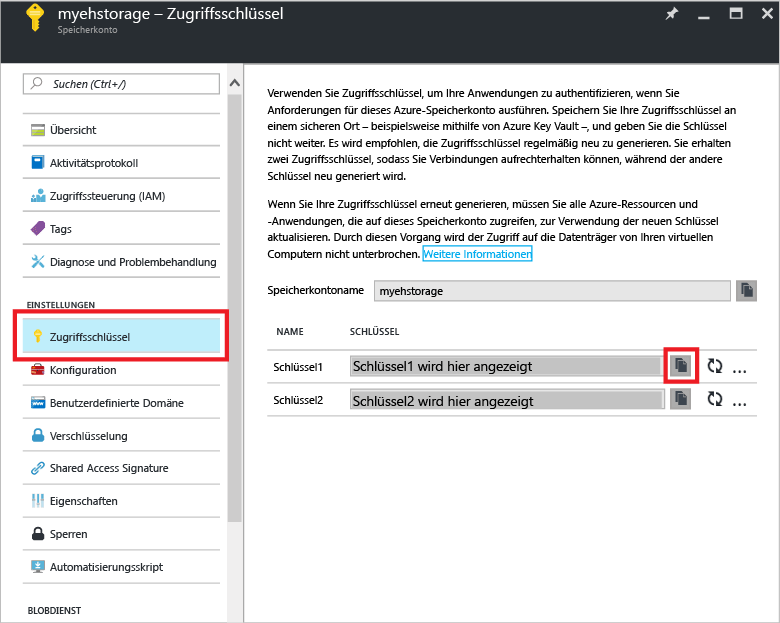
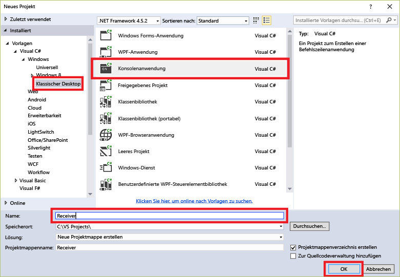
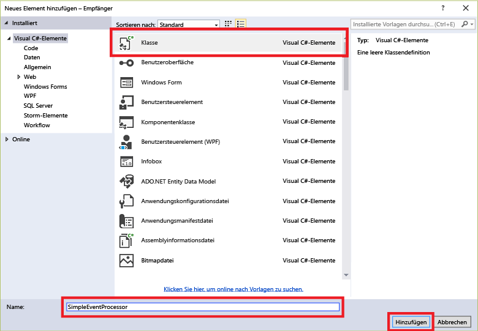

## Empfangen von Nachrichten mit EventProcessorHost

[EventProcessorHost][] ist eine .NET-Klasse, die das Empfangen von Ereignissen von Event Hubs durch Verwalten von permanenten Prüfpunkten und parallelen Empfangsvorgängen von diesen Event Hubs vereinfacht. Mit [EventProcessorHost][] können Sie Ereignisse selbst dann auf mehrere Empfänger aufteilen, wenn sie in verschiedenen Knoten gehostet werden. In diesem Beispiel wird die Verwendung von [EventProcessorHost][] für einen einzelnen Empfänger veranschaulicht. Im Beispiel [Skalieren der Ereignisverarbeitung][] wird veranschaulicht, wie [EventProcessorHost][] mit mehreren Empfängern verwendet wird.

Um [EventProcessorHost][] verwenden zu können, benötigen Sie ein [Azure-Speicherkonto][]\:

1. Melden Sie sich beim [Azure-Portal][] an, und klicken Sie oben links auf dem Bildschirm auf **Neu**.

2. Klicken Sie auf **Daten und Speicher** und anschließend auf **Speicherkonto**.

    

3. Geben Sie auf dem Blatt **Speicherkonto erstellen** einen Namen für das Speicherkonto ein. Wählen Sie ein Azure-Abonnement, eine Ressourcengruppe und einen Standort, an dem die Ressource erstellt werden soll. Klicken Sie dann auf **Erstellen**.

    

4. Klicken Sie in der Liste der Speicherkonten auf das neu erstellte Speicherkonto.

5. Klicken Sie auf dem Blatt des Speicherkontos auf **Zugriffsschlüssel**. Kopieren Sie den Wert für **key1** für die spätere Verwendung in diesem Tutorial.

	

4. Erstellen Sie in Visual Studio mithilfe der Projektvorlage **Konsolenanwendung** ein neues Visual C#-Desktopanwendungsprojekt. Geben Sie dem Projekt den Namen **Receiver**.

    

5. Klicken Sie im Projektmappen-Explorer mit der rechten Maustaste auf die Projektmappe, und klicken Sie dann auf **NuGet-Pakete für Projektmappe verwalten...**.

6. Klicken Sie auf die Registerkarte **Durchsuchen**, und suchen Sie nach `Microsoft Azure Service Bus Event Hub - EventProcessorHost`. Stellen Sie sicher, dass der Projektname (**Empfänger**) im Feld **Version(en)** angegeben ist. Klicken Sie auf **Installieren**, und akzeptieren Sie die Nutzungsbedingungen.

    

	Visual Studio lädt das NuGet-Paket [Azure Service Bus Event Hub – EventProcessorHost](https://www.nuget.org/packages/Microsoft.Azure.ServiceBus.EventProcessorHost) mit allen Abhängigkeiten herunter, installiert es und fügt dem Projekt einen Verweis auf das Paket hinzu.

7. Klicken Sie mit der rechten Maustaste auf das Projekt **Receiver**, klicken Sie auf **Hinzufügen** und dann auf **Klasse**. Geben Sie der neuen Klasse den Namen **SimpleEventProcessor**, und klicken Sie auf **Hinzufügen**, um die Klasse zu erstellen.

	

8. Fügen Sie die folgenden Anweisungen am Anfang der Datei "SimpleEventProcessor.cs" hinzu:

	```
	using Microsoft.ServiceBus.Messaging;
	using System.Diagnostics;
	```

	Ersetzen Sie anschließend den Text der Klasse durch folgenden Code:

	```
    class SimpleEventProcessor : IEventProcessor
	{
	    Stopwatch checkpointStopWatch;

	    async Task IEventProcessor.CloseAsync(PartitionContext context, CloseReason reason)
	    {
	        Console.WriteLine("Processor Shutting Down. Partition '{0}', Reason: '{1}'.", context.Lease.PartitionId, reason);
	        if (reason == CloseReason.Shutdown)
	        {
	            await context.CheckpointAsync();
	        }
	    }

	    Task IEventProcessor.OpenAsync(PartitionContext context)
	    {
	        Console.WriteLine("SimpleEventProcessor initialized.  Partition: '{0}', Offset: '{1}'", context.Lease.PartitionId, context.Lease.Offset);
	        this.checkpointStopWatch = new Stopwatch();
	        this.checkpointStopWatch.Start();
	        return Task.FromResult<object>(null);
	    }

	    async Task IEventProcessor.ProcessEventsAsync(PartitionContext context, IEnumerable<EventData> messages)
	    {
	        foreach (EventData eventData in messages)
	        {
	            string data = Encoding.UTF8.GetString(eventData.GetBytes());

	            Console.WriteLine(string.Format("Message received.  Partition: '{0}', Data: '{1}'",
	                context.Lease.PartitionId, data));
	        }

	        //Call checkpoint every 5 minutes, so that worker can resume processing from 5 minutes back if it restarts.
	        if (this.checkpointStopWatch.Elapsed > TimeSpan.FromMinutes(5))
            {
                await context.CheckpointAsync();
                this.checkpointStopWatch.Restart();
            }
	    }
	}
    ```

	Diese Klasse wird von **EventProcessorHost** zur Verarbeitung der vom Event Hub empfangenen Ereignisse aufgerufen. Beachten Sie, dass die `SimpleEventProcessor`-Klasse eine Stoppuhr verwendet, um in regelmäßigen Abständen die "checkpoint"-Methode für den **EventProcessorHost**-Kontext aufzurufen. Dadurch wird sichergestellt, dass der Empfänger bei einem Neustart maximal nur die Daten verlieren kann, die in den letzten fünf Minuten verarbeitet wurden.

9. Fügen Sie in der **Program**-Klasse die folgende `using`-Anweisungen am Anfang der Datei hinzu:

	```
	using Microsoft.ServiceBus.Messaging;
	```

	Überschreiben Sie dann die `Main`-Methode in der `Program`-Klasse mit dem folgenden Code. Ersetzen Sie dabei den Event Hub-Namen und die zuvor gespeicherte Verbindungszeichenfolge auf Namespace-Ebene sowie das Speicherkonto und den Speicherschlüssel, die Sie in den vorherigen Abschnitten kopiert haben.

    ```
	static void Main(string[] args)
    {
      string eventHubConnectionString = "{Event Hub connection string}";
      string eventHubName = "{Event Hub name}";
      string storageAccountName = "{storage account name}";
      string storageAccountKey = "{storage account key}";
      string storageConnectionString = string.Format("DefaultEndpointsProtocol=https;AccountName={0};AccountKey={1}", storageAccountName, storageAccountKey);

      string eventProcessorHostName = Guid.NewGuid().ToString();
      EventProcessorHost eventProcessorHost = new EventProcessorHost(eventProcessorHostName, eventHubName, EventHubConsumerGroup.DefaultGroupName, eventHubConnectionString, storageConnectionString);
      Console.WriteLine("Registering EventProcessor...");
      var options = new EventProcessorOptions();
      options.ExceptionReceived += (sender, e) => { Console.WriteLine(e.Exception); };
      eventProcessorHost.RegisterEventProcessorAsync<SimpleEventProcessor>(options).Wait();

      Console.WriteLine("Receiving. Press enter key to stop worker.");
      Console.ReadLine();
      eventProcessorHost.UnregisterEventProcessorAsync().Wait();
    }
	```

> [AZURE.NOTE] In diesem Tutorial wird eine einzelne Instanz von [EventProcessorHost][] verwendet. Um den Durchsatz zu erhöhen, sollten Sie mehrere Instanzen von [EventProcessorHost][] ausführen, wie im Beispiel [Skalieren der Ereignisverarbeitung][] beschrieben. In diesen Fällen koordinieren sich die verschiedenen Instanzen automatisch untereinander, um die Last der eingegangenen Ereignisse ausgeglichen zu verteilen. Wenn mehrere Empfänger für jeden Prozess *alle* Ereignisse verarbeiten sollen, müssen Sie das **ConsumerGroup**-Konzept verwenden. Wenn Ereignisse von anderen Computern empfangen werden, kann es hilfreich sein, die [EventProcessorHost][]-Instanzen nach den Computern (oder Rollen) zu benennen, auf denen sie bereitgestellt werden. Weitere Informationen zu diesen Themen finden Sie unter [Event Hubs – Übersicht][] und im [Event Hubs-Programmierhandbuch][].

<!-- Links -->
[Event Hubs – Übersicht]: event-hubs-overview.md
[Event Hubs-Programmierhandbuch]: event-hubs-programming-guide.md
[Skalieren der Ereignisverarbeitung]: https://code.msdn.microsoft.com/Service-Bus-Event-Hub-45f43fc3
[Azure-Speicherkonto]: ../storage/storage-create-storage-account.md
[EventProcessorHost]: http://msdn.microsoft.com/library/azure/microsoft.servicebus.messaging.eventprocessorhost(v=azure.95).aspx
[Azure-Portal]: https://portal.azure.com

<!---HONumber=AcomDC_0921_2016-->