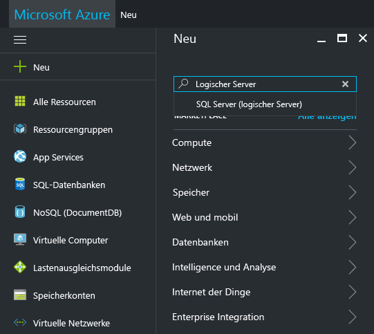
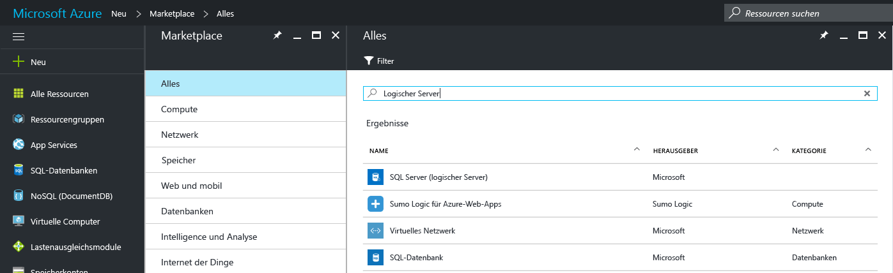
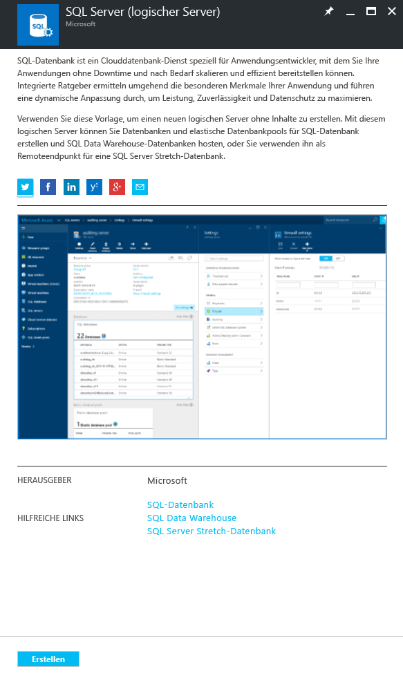
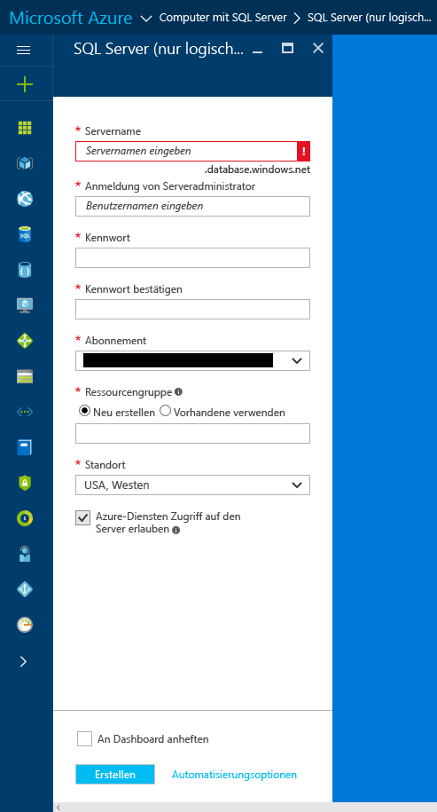
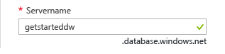
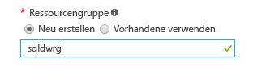
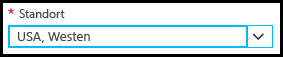

### Erstellen eines neuen logischen SQL-Servers im Azure-Portal

1. Klicken Sie auf **Neu**, suchen Sie nach dem **logischen Server**, und drücken Sie dann die **EINGABETASTE**.

    
2. Wählen Sie die Option **SQL Server (logischer Server)**. 

    
  
3. Klicken Sie auf **Erstellen**, um das neue Blatt „SQL Server (logischer Server) zu öffnen.

   <kbd>  </kbd>
    <kbd> </kbd>
  
3. Geben Sie auf dem Blatt „SQL Server (logischer Server)“ im Textfeld für den Servernamen einen gültigen Namen für den neuen logischen Server an. Wenn der angegebene Name gültig ist, wird ein grünes Häkchen angezeigt.
    
    

    > [!IMPORTANT]
    > Der vollqualifizierte Name für den neuen Server lautet „<Ihr_Servername>.database.windows.net“.
    >
    
4. Geben Sie im Textfeld „Serveradministratoranmeldung“ einen Benutzernamen für die SQL-Authentifizierungsanmeldung für diesen Server ein. Diese Anmeldung wird als Serverprinzipalanmeldung bezeichnet. Wenn der angegebene Name gültig ist, wird ein grünes Häkchen angezeigt.
    
    
5. Geben Sie in den Textfeldern **Kennwort** und **Kennwort bestätigen** ein Kennwort für das Konto für die Serverprinzipalanmeldung an. Wenn das angegebene Kennwort gültig ist, wird ein grünes Häkchen angezeigt.
    
    
6. Wählen Sie ein Abonnement aus, für das Sie über die Berechtigung zum Erstellen von Objekten verfügen.

    
7. Wählen Sie im Textfeld „Ressourcengruppe“ die Option **Neu erstellen**, und geben Sie dann im Textfeld „Ressourcengruppe“ einen gültigen Namen für die neue Ressourcengruppe ein. (Sie können auch eine vorhandene Ressourcengruppe verwenden, wenn Sie bereits eine erstellt haben.) Wenn der angegebene Name gültig ist, wird ein grünes Häkchen angezeigt.

    

8. Wählen Sie im Textfeld **Standort** ein geeignetes Rechenzentrum für Ihren Standort aus, z.B. „Australien, Osten“.
    
    
    
    > [!TIP]
    > Das Kontrollkästchen **Azure-Diensten Zugriff auf den Server erlauben** kann auf diesem Blatt nicht geändert werden. Sie können diese Einstellung auf dem Blatt für die Serverfirewall ändern. Weitere Informationen finden Sie unter [Erste Schritte mit der Sicherheit](../articles/sql-database/sql-database-manage-servers-portal.md).
    >
    
9. Klicken Sie auf **Erstellen**.

    

<!--HONumber=Feb17_HO3-->

