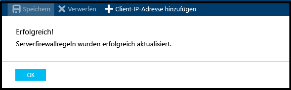

### Erstellen einer Firewallregel auf Serverebene im Azure-Portal

1. Klicken Sie auf dem Blatt „SQL Server“ unter „Einstellungen“ auf **Firewall**, um das Blatt „Firewall“ für den SQL-Server zu öffnen.

    
    
2. Überprüfen Sie die angezeigte Client-IP-Adresse, und vergewissern Sie sich, dass dies Ihre IP-Adresse für das Internet ist, indem Sie einen Browser Ihrer Wahl verwenden (Frage: „Wie lautet meine IP-Adresse“). Es kann vorkommen, dass diese Adressen aus unterschiedlichen Gründen nicht übereinstimmen.

    

3. Wenn die IP-Adressen übereinstimmen, können Sie in der Symbolleiste auf **Client-IP-Adresse hinzufügen** klicken.

    

    > [!NOTE]
    > Sie können die Firewall auf dem SQL-Server (logischer Server) für eine einzelne IP-Adresse oder einen gesamten Adressbereich öffnen. Mit dem Öffnen der Firewall wird es SQL-Administratoren und Benutzern ermöglicht, sich auf dem Server an allen Datenbanken anzumelden, für die sie über gültige Anmeldeinformationen verfügen.
    >

4. Klicken Sie in der Symbolleiste auf **Speichern**, um diese Firewallregel auf Serverebene zu speichern, und klicken Sie dann auf **OK**.

    

<!--HONumber=Jan17_HO3-->

