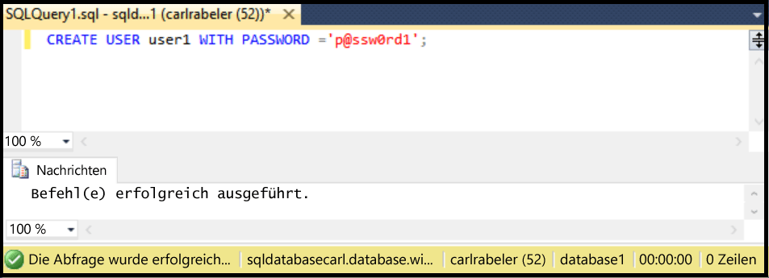

## Erstellen neuer Datenbankbenutzer mit SSMS

In den folgenden Schritten wird davon ausgegangen, dass Sie SSMS verwenden und eine Verbindung mit der SQL-Datenbank im Objekt-Explorer hergestellt haben. Darüber hinaus wird angenommen, dass die Verbindung mit dem logischen Server der SQL-Datenbank als Prinzipaladministrator auf Serverebene oder mit einem Benutzerkonto mit Berechtigungen zum Erstellen eines neuen Benutzers hergestellt wurde. Zudem wird in den folgenden Schritten davon ausgegangen, dass eine Benutzerdatenbank vorhanden ist, in der Sie ein Benutzerkonto erstellen möchten.

1. Erweitern Sie im Objekt-Explorer den Datenbankknoten, und wählen Sie die Datenbank aus, in der Sie ein neues Benutzerkonto erstellen möchten.

     

2. Klicken Sie mit der rechten Maustaste auf die ausgewählte Datenbank, und klicken Sie dann auf **Abfrage**.

     

3. Bearbeiten Sie im Abfragefenster die folgende Transact-SQL-Anweisungen, und verwenden Sie sie zum Erstellen eines enthaltenen Benutzers in Ihrer Benutzerdatenbank.

    ```CREATE USER user1 WITH PASSWORD ='p@ssw0rd1';

     

<!---HONumber=AcomDC_0420_2016-->