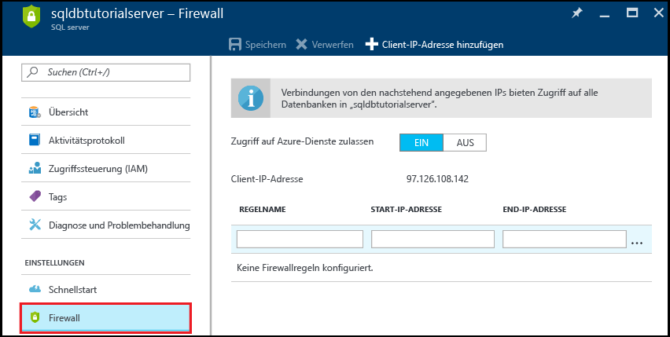
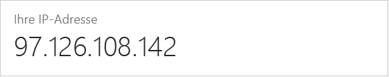

<!--
includes/sql-database-create-new-server-firewall-portal.md

Latest Freshness check:  2016-11-28 , rickbyh.

As of circa 2016-04-11, the following topics might include this include:
articles/sql-database/sql-database-get-started.md
articles/sql-database/sql-database-configure-firewall-settings
articles/sql-data-warehouse-get-started-provision.md

-->
### Erstellen einer Firewallregel auf Serverebene im Azure-Portal

1. Klicken Sie auf dem Blatt „SQL Server“ unter „Einstellungen“ auf **Firewall**, um das Blatt „Firewall“ für den SQL-Server zu öffnen.

    <!--  -->

2. Überprüfen Sie die angezeigte Client-IP-Adresse, und vergewissern Sie sich, dass dies Ihre IP-Adresse für das Internet ist, indem Sie einen Browser Ihrer Wahl verwenden (Frage: „Wie lautet meine IP-Adresse“). Es kann vorkommen, dass diese Adressen aus unterschiedlichen Gründen nicht übereinstimmen.

    <!--  -->

3. Wenn die IP-Adressen übereinstimmen, können Sie in der Symbolleiste auf **Client-IP-Adresse hinzufügen** klicken.

    

    > [!NOTE]
    > Sie können die SQL-Datenbank-Firewall auf dem Server für eine einzelne IP-Adresse oder einen gesamten Adressbereich öffnen. Mit dem Öffnen der Firewall wird es SQL-Administratoren und Benutzern ermöglicht, sich auf dem Server an allen Datenbanken anzumelden, für die sie über gültige Anmeldeinformationen verfügen.
    >

4. Klicken Sie in der Symbolleiste auf **Speichern**, um diese Firewallregel auf Serverebene zu speichern, und klicken Sie dann auf **OK**.

    

> [!Tip]
> Ein Tutorial finden Sie unter [SQL-Datenbank-Tutorial: Erstellen eines Servers, einer Firewallregel auf Serverebene, einer Beispieldatenbank und einer Firewallregel auf Datenbankebene und Herstellen der Verbindung mit SQL Server Management Studio](../articles/sql-database/sql-database-get-started.md).    
>
