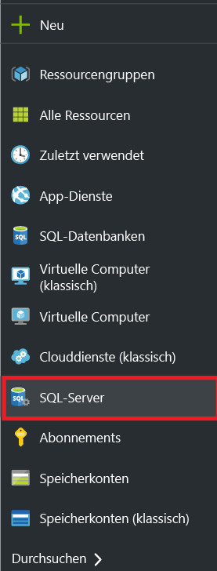
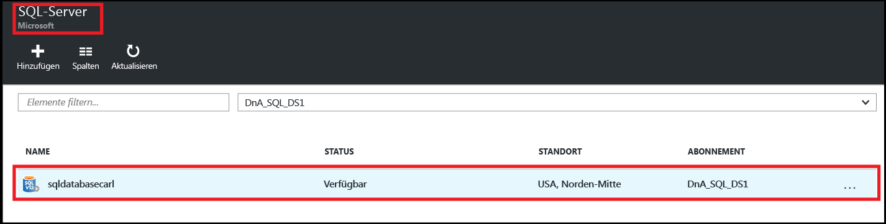
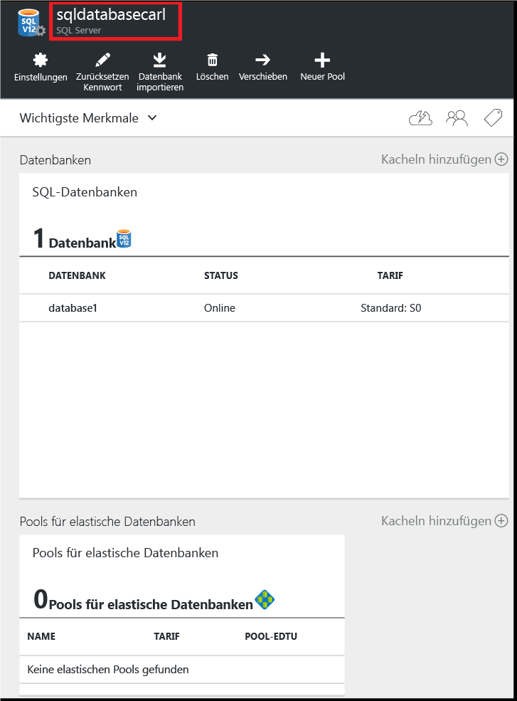
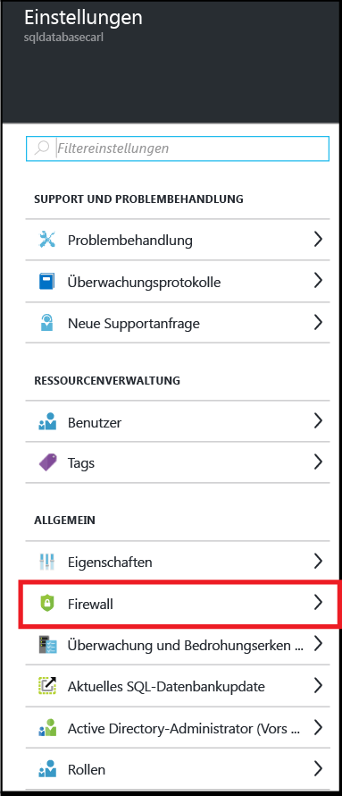
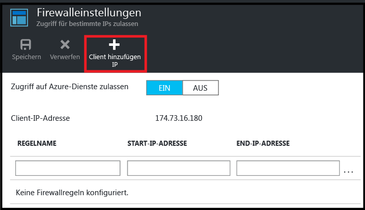
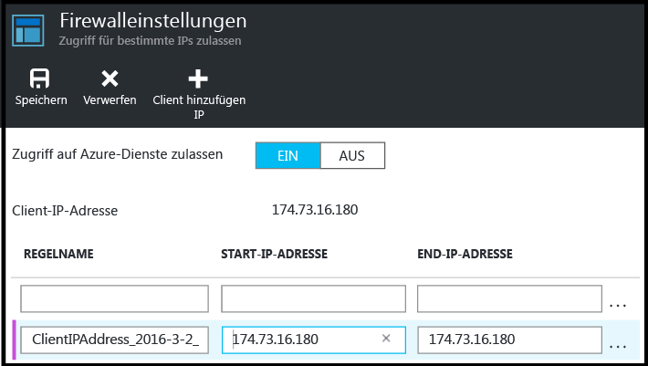
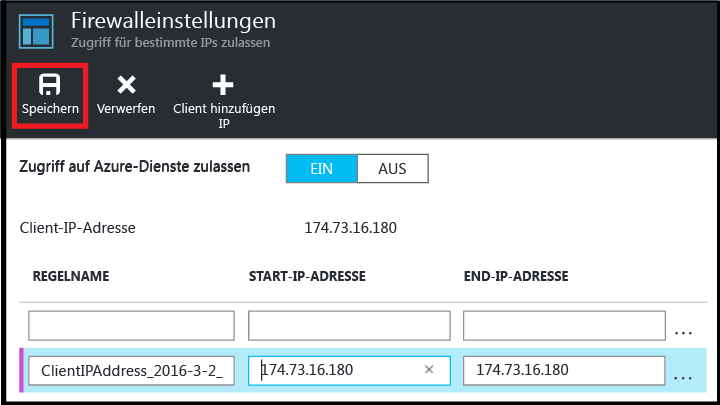

<!--
includes/sql-database-create-new-server-firewall-portal.md

Latest Freshness check:  2016-08-01 , rickbyh.

As of circa 2016-04-11, the following topics might include this include:
articles/sql-database/sql-database-get-started-tutorial.md
articles/sql-database/sql-database-configure-firewall-settings

-->
## Erstellen einer neuen Azure SQL-Firewall auf Serverebene

Führen Sie im Azure-Portal die folgenden Schritte aus, um eine Firewallregel auf Serverebene zu erstellen, die Verbindungen von einer einzelnen IP-Adresse (Ihr Clientcomputer) oder einem gesamten IP-Adressbereich mit einem logischen SQL-Datenbankserver zulässt.

1. Stellen Sie eine Verbindung mit dem [Azure-Portal](http://portal.azure.com) her (sofern noch keine Verbindung besteht).
2. Klicken Sie auf dem Standardblatt auf **SQL Server**.

  	

3. Klicken Sie auf dem Blatt **SQL Server** auf den Server, auf dem die Firewallregel erstellt werden soll.

 	

4. Überprüfen Sie die Eigenschaften des Servers.

 	

5. Klicken Sie auf dem Blatt **Einstellungen** auf **Firewall**.

 	

 	> [AZURE.NOTE] Sie können auch auf dem Blatt **Datenbank** über die Symbolleiste auf das Blatt **Firewalleinstellungen** der Serverebene zugreifen.

6. Klicken Sie auf **Client-IP-Adresse hinzufügen**, damit Azure eine Regel für Ihre Client-IP-Adresse erstellt.

      

7. Klicken Sie optional auf die hinzugefügte IP-Adresse, um die Firewalladresse zu bearbeiten und Zugriff auf einen IP-Adressbereich zu gewähren.

      

8. Klicken Sie auf **Speichern**, um die Firewallregel auf Serverebene zu erstellen.

     

	>[AZURE.IMPORTANT] Die Client-IP-Adresse kann sich von Zeit zu Zeit ändern, und Sie können dann möglicherweise nicht auf den Server zugreifen, bis Sie eine neue Firewallregel erstellt haben. Sie können Ihre IP-Adresse mit [Bing](http://www.bing.com/search?q=my%20ip%20address) überprüfen. Fügen Sie dann eine einzelne IP-Adresse oder einen Bereich von IP-Adressen hinzu. Ausführlichere Informationen finden Sie unter [Verwalten von Firewalleinstellungen](sql-database-configure-firewall-settings.md#manage-existing-server-level-firewall-rules-through-the-azure-portal).

<!---HONumber=AcomDC_0912_2016-->