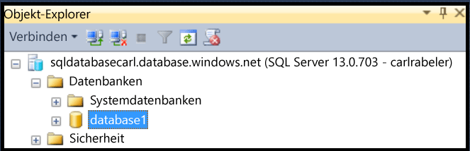
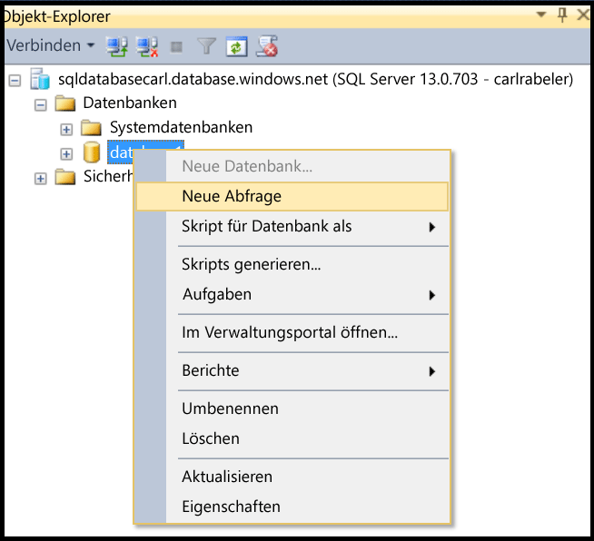
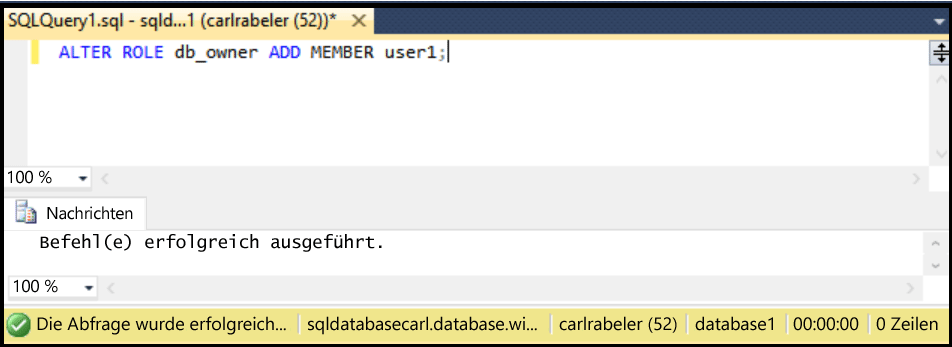

## Erteilen von „db\_owner“-Berechtigungen für neue Datenbankbenutzer

Führen Sie die folgenden Schritte aus, um einem vorhandenen Datenbankbenutzer „db\_owner“-Berechtigungen zuzuweisen.

Bei diesen Schritten wird davon ausgegangen, dass Sie mit SSMS eine Verbindung mit der SQL-Datenbank im Objekt-Explorer herstellt haben und mit dem logischen SQL-Datenbankserver als Prinzipaladministrator auf Serverebene oder mit einem Benutzerkonto, das über die Berechtigungen zum Erstellen eines neuen Benutzers verfügt, verbunden sind.

1. Erweitern Sie im Objekt-Explorer den Datenbankknoten, und wählen Sie die Datenbank mit dem Benutzer aus, dem Sie DBO-Berechtigungen erteilen möchten.

     

2. Klicken Sie mit der rechten Maustaste auf die ausgewählte Datenbank, und klicken Sie dann auf **Abfrage**.

     

3. Bearbeiten Sie im Abfragefenster die folgende Transact-SQL-Anweisungen, und verwenden Sie sie zum Erteilen von DBO-Berechtigungen für einen bestimmten Benutzer.

    ```ALTER ROLE db_owner ADD MEMBER user1;
    ```

     

<!---HONumber=AcomDC_0629_2016-->