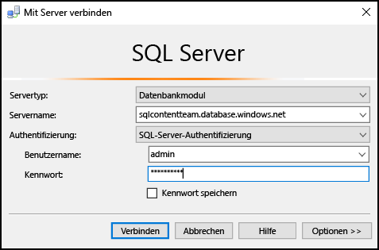
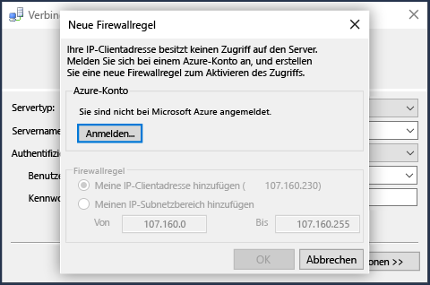
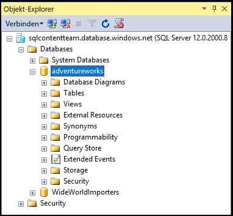

## Herstellen einer Verbindung mit Azure SQL-Datenbank per SQL Server-Authentifizierung
In den folgenden Schritten wird beschrieben, wie Sie mit SSMS eine Verbindung mit einem Azure SQL-Server und einer Datenbank herstellen. Wenn Sie keinen Server und keine Datenbank haben, helfen Ihnen die Informationen unter [Erstellen einer SQL-Datenbank in wenigen Minuten](../articles/sql-database/sql-database-get-started.md) bei der Erstellung weiter.

1. Starten Sie SSMS, indem Sie im Windows-Suchfeld **Microsoft SQL Server Management Studio** eingeben und dann auf die Desktop-App klicken.
2. Geben Sie im Fenster **Mit Server verbinden** die folgenden Informationen ein (falls SSMS bereits ausgeführt wird, klicken Sie auf **Verbinden > Datenbankmodul**, um das Fenster **Mit Server verbinden** zu öffnen):
   
   * **Servertyp**: Standardmäßig ist „Datenbankmodul“ angegeben. Ändern Sie diesen Wert nicht.
   * **Servername**: Geben Sie den vollqualifizierten Namen Ihres Azure SQL-Datenbankservers im folgenden Format ein: *&lt;Servername>*.**database.windows.net**
   * **Authentifizierungstyp**: In diesem Artikel wird beschrieben, wie Sie per **SQL Server-Authentifizierung** eine Verbindung herstellen. Ausführliche Informationen zum Herstellen einer Verbindung mit Azure Active Directory finden Sie unter [Herstellen einer Verbindung mithilfe der integrierten Active Directory-Authentifizierung](../articles/sql-database/sql-database-aad-authentication.md#connect-using-active-directory-integrated-authentication), [Herstellen einer Verbindung mithilfe der Active Directory-Kennwortauthentifizierung](../articles/sql-database/sql-database-aad-authentication.md#connect-using-active-directory-password-authentication) und [Herstellen einer Verbindung mithilfe der universellen Active Directory-Authentifizierung](../articles/sql-database/sql-database-ssms-mfa-authentication.md).
   * **Benutzername**: Geben Sie den Namen eines Benutzers mit Zugriff auf eine Datenbank auf dem Server ein (z.B. den Namen des *Serveradministrators*, den Sie beim Erstellen des Servers eingerichtet haben). 
   * **Kennwort**: Geben Sie das Kennwort für den angegebenen Benutzer ein (z.B. das *Kennwort*, das Sie beim Erstellen des Servers eingerichtet haben).
     
       
3. Klicken Sie auf **Verbinden**.
4. Standardmäßig verfügen neue Server nicht über definierte [Firewallregeln](../articles/sql-database/sql-database-firewall-configure.md) , sodass die Verbindungsherstellung für Clients am Anfang blockiert wird. Falls für Ihren Server noch keine Firewallregel eingerichtet wurde, über die Ihre jeweilige IP-Adresse die Verbindung herstellen kann, bietet SSMS Ihnen die Möglichkeit zur Erstellung einer Firewallregel für die Serverebene an.
   
    Klicken Sie auf **Anmelden** , und erstellen Sie eine Firewallregel für die Serverebene. Sie müssen ein Azure-Administrator sein, um eine Firewallregel auf Serverebene erstellen zu können.
   
       
5. Nach der erfolgreichen Herstellung der Verbindung mit Ihrer Azure SQL-Datenbank wird dem **Objekt-Explorer** geöffnet, und Sie können auf die Datenbank zugreifen, um [Verwaltungsaufgaben auszuführen oder Daten abzufragen](../articles/sql-database/sql-database-manage-azure-ssms.md).
   
     

## Durchführen der Problembehandlung für Verbindungsfehler
Der häufigste Grund für Verbindungsfehler sind fehlerhafte Servernamen und Probleme mit der Netzwerkverbindung. Beachten Sie, dass <*Servername*> der Name des Servers und nicht der Datenbank ist und dass Sie den vollqualifizierten Servernamen angeben müssen: `<servername>.database.windows.net`

Stellen Sie außerdem sicher, dass der Benutzername und das Kennwort keine Schreibfehler oder zusätzlichen Leerstellen enthalten (bei Benutzernamen wird die Groß-/Kleinschreibung nicht beachtet, aber bei Kennwörtern ist dies der Fall). 

Sie können das Protokoll und die Portnummer auch wie folgt explizit mit dem Servernamen festlegen: `tcp:servername.database.windows.net,1433`

Probleme mit der Netzwerkverbindung können ebenfalls zu Verbindungsfehlern und Zeitüberschreitungen führen. Der einfache erneute Versuch, die Verbindung herzustellen (wenn Sie sicher sind, dass Servername, Anmeldeinformationen und Firewallregeln stimmen), kann bereits zum Erfolg führen.

Details und weitere Informationen zu Verbindungsproblemen finden Sie unter [Durchführen der Problembehandlung, Diagnose und Verhinderung von SQL-Verbindungsfehlern und vorübergehenden Fehlern für SQL-Datenbank](../articles/sql-database/sql-database-connectivity-issues.md).

<!----HONumber=Nov16_HO2-->

