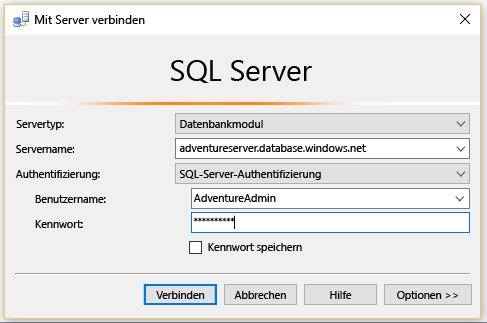
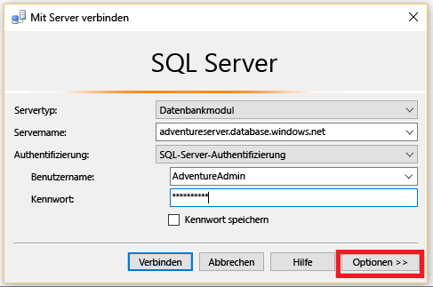
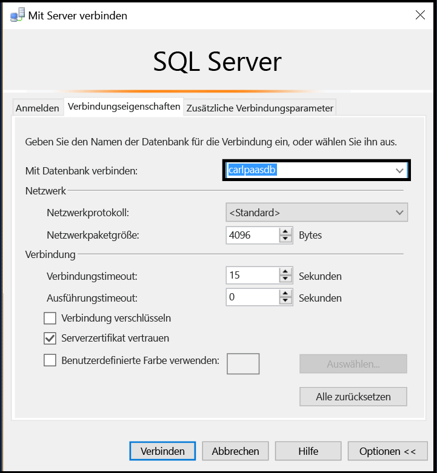
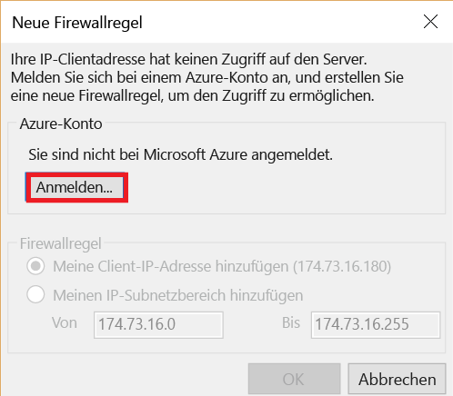
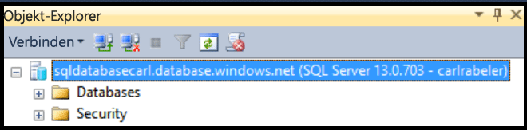

## Herstellen einer Verbindung mit Azure SQL-Datenbank als Benutzer

Führen Sie die folgenden Schritte aus, um mit SSMS als Benutzer eine Verbindung mit Azure SQL-Datenbank herzustellen.

1. Geben Sie im Windows-Suchfeld „Microsoft SQL Server Management Studio“ ein, und klicken Sie dann auf die Desktop-App, um SSMS zu starten.

2. Geben Sie im Fenster „Mit Server verbinden“ die folgenden Informationen ein:

- **Servertyp**: Standardmäßig ist „Datenbankmodul“ angegeben. Ändern Sie diesen Wert nicht.
 - **Servername**: Geben Sie den Namen des Servers, auf dem die SQL-Datenbank gehostet wird, im folgenden Format ein: *&lt;Servername>*.**database.windows.net**
 - **Authentifizierungstyp**: Wählen Sie „SQL-Authentifizierung“, wenn Sie gerade die ersten Schritte ausführen. Wenn Sie Active Directory für Ihren logischen SQL-Datenbankserver aktiviert haben, können Sie entweder „Active Directory-Kennwortauthentifizierung“ oder „Integrierte Active Directory-Authentifizierung“ wählen.
 - **Benutzername**: Wenn Sie „SQL-Authentifizierung“ oder „Active Directory-Kennwortauthentifizierung“ gewählt haben, geben Sie den Namen eines Benutzers ein, der Zugriff auf eine Datenbank auf dem Server hat.
 - **Kennwort**: Wenn Sie „SQL-Authentifizierung“ oder „Active Directory-Kennwortauthentifizierung“ gewählt haben, geben Sie das Kennwort für den angegebenen Benutzer ein.
   
       

3. Klicken Sie auf **Optionen**, um die Datenbank anzugeben, mit der Sie eine Verbindung herstellen möchten.

      
 
4. Wählen Sie unter **Mit Datenbank verbinden** die Datenbank aus, mit der Sie eine Verbindung herstellen möchten.

     

5. Klicken Sie auf **Verbinden**.
 
6. Wenn die IP-Adresse des Clients keinen Zugriff auf den logischen SQL-Datenbankserver hat, werden Sie aufgefordert, sich an einem Azure-Konto anzumelden und eine Firewallregel auf Serverebene zu erstellen. Wenn Sie ein Administrator des Azure-Abonnements sind, können Sie auf **Anmelden** klicken, um eine Firewall auf Serverebene zu erstellen. Wenn dies nicht der Fall ist, sollten Sie einen Administrator bitten, entweder eine Firewallregel auf Serverebene oder eine Firewallregel in der Datenbank zu erstellen, mit der die Verbindung hergestellt werden soll.
 
      
 
7. Wenn Sie mit Ihren Anmeldeinformationen Zugriff auf die angegebene Datenbank haben, wird der Objekt-Explorer geöffnet, und Sie können je nach Ihren Benutzerberechtigungen Verwaltungsaufgaben durchführen oder Daten abfragen.
  
      
      
 
 ## Durchführen der Problembehandlung für Verbindungsfehler

Die häufigste Ursache für Verbindungsfehler sind Unregelmäßigkeiten beim Servernamen (Erinnerung: <*Servername*> ist der Name des logischen Servers, nicht der Datenbank), Benutzernamen oder Kennwort sowie das Verbieten der Verbindung durch den Server aus Sicherheitsgründen.

<!---HONumber=AcomDC_0420_2016-->