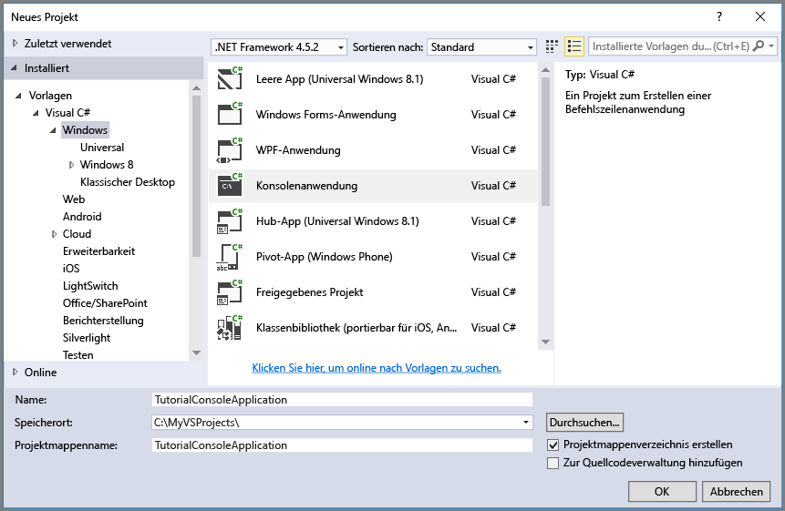

## <a name="set-up-your-development-environment"></a>Einrichten der Entwicklungsumgebung
Richten Sie als Nächstes Ihre Entwicklungsumgebung in Visual Studio ein, damit Sie die Codebeispiele dieser Anleitung ausprobieren können.

### <a name="create-a-windows-console-application-project"></a>Erstellen eines Windows-Konsolenanwendungsprojekts
Erstellen Sie in Visual Studio eine neue Windows-Konsolenanwendung. In den folgenden Schritten wird veranschaulicht, wie Sie eine Konsolenanwendung in Visual Studio 2017 erstellen. Die Schritte in anderen Versionen von Visual Studio sind aber ähnlich.

1. Wählen Sie **Datei** > **Neu** > **Projekt**.
2. Wählen Sie **Installiert** > **Vorlagen** > **Visual C#** > **Klassischer Windows-Desktop**.
3. Wählen Sie **Konsolen-App (.NET Framework)**.
4. Geben Sie im Feld **Name:** einen Namen für Ihre Anwendung ein.
5. Klicken Sie auf **OK**.



Alle Codebeispiele in diesem Tutorial können in der Datei `Program.cs` Ihrer Konsolenanwendung der `Main()`-Methode hinzugefügt werden.

Sie können die Azure Storage-Clientbibliothek in jeder Art von .NET-Anwendung nutzen, z.B. einem Azure-Clouddienst oder einer Azure-Web-App, einer Desktopanwendung oder einer mobilen Anwendung. In diesem Leitfaden verwenden wir der Einfachheit halber eine Konsolenanwendung.

### <a name="use-nuget-to-install-the-required-packages"></a>Verwenden von NuGet zum Installieren der erforderlichen Pakete
Es gibt zwei Pakete, auf die Sie in Ihrem Projekt für dieses Tutorial verweisen müssen:

* [Microsoft Azure Storage Client Library für .NET](https://www.nuget.org/packages/WindowsAzure.Storage/): Mit diesem Paket erhalten Sie programmgesteuerten Zugriff auf Datenressourcen in Ihrem Speicherkonto.
* [Microsoft Azure Configuration Manager Library für .NET](https://www.nuget.org/packages/Microsoft.WindowsAzure.ConfigurationManager/): Mit diesem Paket wird eine Klasse zum Analysieren einer Verbindungszeichenfolge in einer Konfigurationsdatei bereitgestellt. Dies gilt unabhängig davon, wo die Anwendung ausgeführt wird.

Sie können NuGet verwenden, um beide Pakete zu erhalten. Folgen Sie diesen Schritten:

1. Klicken Sie im **Projektmappen-Explorer** mit der rechten Maustaste auf das Projekt, und wählen Sie **NuGet-Pakete verwalten** aus.
2. Suchen Sie online nach „WindowsAzure.Storage“, und klicken Sie auf **Installieren** , um die Storage Client Library und die dazugehörigen Abhängigkeiten zu installieren.
3. Suchen Sie online nach „WindowsAzure.ConfigurationManager“, und klicken Sie auf **Installieren**, um Azure Configuration Manager zu installieren.

> [!NOTE]
> Das Storage Client Library-Paket ist auch im [Azure SDK für .NET](https://azure.microsoft.com/downloads/)enthalten. Wir empfehlen Ihnen aber die Installation der Storage Client Library über NuGet, um sicherzustellen, dass Sie immer über die aktuelle Version der Clientbibliothek verfügen.
> 
> Die ODataLib-Abhängigkeiten in der Storage Client Library für .NET werden mit den ODataLib-Paketen aufgelöst, die unter NuGet verfügbar sind (nicht unter WCF Data Services). Die ODataLib-Bibliotheken können direkt heruntergeladen werden, oder es wird über Ihr Codeprojekt durch NuGet darauf verwiesen. Die spezifischen ODataLib-Pakete, die von der Speicherclientbibliothek verwendet werden, lauten [OData](http://nuget.org/packages/Microsoft.Data.OData/), [Edm](http://nuget.org/packages/Microsoft.Data.Edm/) und [Spatial](http://nuget.org/packages/System.Spatial/). Diese Bibliotheken werden von Azure-Tabellenspeicherklassen verwendet und sind erforderliche Abhängigkeiten für die Programmierung mit der Speicherclientbibliothek.
> 
> 

### <a name="determine-your-target-environment"></a>Bestimmen der Zielumgebung
Es gibt für die Ausführung der Beispiele in diesem Leitfaden zwei Umgebungsoptionen:

* Sie können den Code über ein Azure Storage-Konto in der Cloud ausführen. 
* Sie können den Code über den Azure-Speicheremulator ausführen. Der Speicheremulator ist eine lokale Umgebung, in der ein Azure Storage-Konto in der Cloud emuliert wird. Der Emulator ist eine kostenlose Option zum Testen und Debuggen von Code, während sich Ihre Anwendung in der Entwicklung befindet. Für den Emulator wird ein bekanntes Konto mit Schlüssel verwendet. Weitere Informationen finden Sie unter [Einsatz des Azure-Speicheremulators für Entwicklung und Tests](../articles/storage/storage-use-emulator.md).

Wenn Sie ein Speicherkonto in der Cloud verwenden möchten, müssen Sie den primären Zugriffsschlüssel für Ihr Speicherkonto aus dem Azure-Portal kopieren. Weitere Informationen finden Sie unter [Anzeigen und Kopieren von Speicherzugriffsschlüsseln](../articles/storage/storage-create-storage-account.md#view-and-copy-storage-access-keys).

> [!NOTE]
> Sie können den Speicheremulator als Ziel festlegen, um jegliche Kosten im Zusammenhang mit Azure Storage zu vermeiden. Wenn jedoch ein Azure-Speicherkonto in der Cloud das Ziel sein soll, sind die Kosten für das Ausführen dieses Lernprogramms vernachlässigbar.
> 
> 

### <a name="configure-your-storage-connection-string"></a>Konfigurieren der Speicherverbindungszeichenfolge
Die Azure-Speicherclientbibliothek für .NET unterstützt die Verwendung einer Speicherverbindungszeichenfolge zum Konfigurieren von Endpunkten und Anmeldeinformationen für den Zugriff auf Speicherdienste. Am einfachsten lässt sich die Speicherverbindungszeichenfolge in einer Konfigurationsdatei verwalten. 

Weitere Informationen zu Verbindungszeichenfolgen finden Sie unter [Konfigurieren von Verbindungszeichenfolgen für Azure Storage](../articles/storage/storage-configure-connection-string.md).

> [!NOTE]
> Ihr Speicherkontoschlüssel ähnelt dem Stammkennwort für das Speicherkonto. Achten Sie darauf, den Speicherkontoschlüssel immer gut zu schützen. Geben Sie ihn nicht an andere Benutzer weiter, vermeiden Sie das Hartcodieren, und speichern Sie ihn nicht in einer Klartextdatei, auf die andere Benutzer zugreifen können. Generieren Sie Ihren Schlüssel mithilfe des Azure-Portals neu, wenn Sie der Meinung sind, dass er nicht mehr sicher ist.
> 
> 

Öffnen Sie zum Konfigurieren der Verbindungszeichenfolge die Datei `app.config` im Projektmappen-Explorer in Visual Studio. Fügen Sie den Inhalt des `<appSettings>` -Elements hinzu (wie unten dargestellt). Ersetzen Sie `account-name` durch den Namen Ihres Speicherkontos und `account-key` durch den Zugriffsschlüssel des Kontos:

```xml
<configuration>
    <startup> 
        <supportedRuntime version="v4.0" sku=".NETFramework,Version=v4.5.2" />
    </startup>
    <appSettings>
        <add key="StorageConnectionString" value="DefaultEndpointsProtocol=https;AccountName=account-name;AccountKey=account-key" />
    </appSettings>
</configuration>
```

Ihre Konfigurationseinstellung kann beispielsweise wie folgt lauten:

```xml
<add key="StorageConnectionString" value="DefaultEndpointsProtocol=https;AccountName=storagesample;AccountKey=GMuzNHjlB3S9itqZJHHCnRkrokLkcSyW7yK9BRbGp0ENePunLPwBgpxV1Z/pVo9zpem/2xSHXkMqTHHLcx8XRA==" />
```

Wenn Sie den Speicheremulator verwenden möchten, können Sie eine Verknüpfung nutzen, mit der eine Zuordnung zum bekannten Kontonamen und dem Schlüssel hergestellt wird. In diesem Fall lautet die Verbindungszeichenfolge wie folgt:

```xml
<add key="StorageConnectionString" value="UseDevelopmentStorage=true;" />
```

