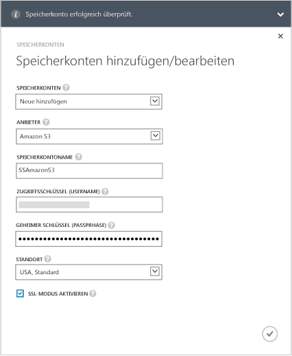

<!--author=alkohli last changed: 9/17/15-->

#### So fügen Sie ein Speicherkonto zur StorSimple 8000-Serie mit Update 1.0 hinzu
1. Wählen Sie auf der StorSimple-Manager-Dienst-Startseite Ihren Dienst aus, und doppelklicken Sie dann darauf. Damit gelangen Sie auf die Seite **Schnellstart** . Wählen Sie die Seite **Konfigurieren** aus.
2. Klicken Sie auf **Speicherkonto hinzufügen/bearbeiten**.
3. Klicken Sie im Dialogfeld **Speicherkonto hinzufügen/bearbeiten** auf **Neues hinzufügen**.
4. Wählen Sie im Feld **Anbieter** den entsprechenden Clouddienstanbieter aus. Die unterstützten Anbieter sind: Azure, Amazon S3, Amazon S3 mit RRS, HP und OpenStack. Geben Sie die Anmeldeinformationen und den Speicherort des Speicherkontos Ihres Clouddienstanbieters an. Die Felder für die Anmeldeinformationen unterscheiden sich in Abhängigkeit vom angegebenen Clouddienstanbieter. 
   
   * Wenn Sie Azure als Clouddienstanbieter ausgewählt haben, geben Sie den **Namen** und den primären **Zugriffsschlüssel** für Ihr Microsoft Azure-Speicherkonto an. Der Speicherort wird für ein Azure-Konto automatisch angegeben.
     
        
   * Wenn Sie Amazon S3 oder Amazon-S3 mit RRS ausgewählt haben, geben Sie einen aussagekräftigen **Namen für das Speicherkonto**, den **Zugriffsschlüssel** und den **geheimen Schlüssel** an. Bei Amazon S3 und Amazon S3 mit RRS werden die folgenden Speicherorte unterstützt:
     
     * USA, Standard
     * USA, Westen (Oregon)
     * USA, Westen (Nordkalifornien)
     * Europa (Irland)
     * Asien-Pazifik, (Singapur)
     * Asien-Pazifik, (Sydney)
     * Asien-Pazifik, (Tokio)
     * Südamerika (São Paulo)
       
       
   * Wenn Sie HP als Clouddienstanbieter ausgewählt haben, geben Sie einen aussagekräftigen **Namen für das Speicherkonto**, die **Mandanten-ID**, den **Benutzernamen** und das **Kennwort** an. Bei HP werden die folgenden Speicherorte unterstützt:
     
     * USA, Osten
     * USA, Westen
       
       
   * Wenn Sie **OpenStack** als Clouddienstanbieter ausgewählt haben, geben Sie einen **Hostnamen**, den **Zugriffsschlüssel** und den **geheimen Schlüssel** an.
     
     > [!NOTE]
     > Für alle Anbieter von Clouddiensten mit Ausnahme von Azure ist es zulässig, einen Anzeigename zu wählen. Sie können verschiedene Anzeigenamen verwenden und mehr als ein Speicherkonto mit demselben Satz an Anmeldeinformationen erstellen.
     > 
     > 
     
        
5. Aktivieren Sie **SSL-Modus aktivieren** , um einen sicheren Kanal für die Netzwerkkommunikation zwischen Ihrem Gerät und der Cloud zu erstellen. Deaktivieren Sie das Kontrollkästchen **SSL-Modus aktivieren** nur, wenn der Betrieb in einer privaten Cloud stattfindet.
   
   > [!NOTE]
   > Bei Verwendung von HP als Anbieter wird immer SSL aktiviert.
   > 
   > 
6. Klicken Sie auf das Häkchensymbol  . Sie werden benachrichtigt, nachdem das Speicherkonto erfolgreich erstellt wurde.
7. Das neu erstellte Speicherkonto wird auf der Seite **Konfigurieren** unter **Speicherkonten** angezeigt. Klicken Sie auf **Speichern** , um das neue Speicherkonto zu speichern. Klicken Sie auf **OK** , wenn Sie zur Bestätigung aufgefordert werden.

