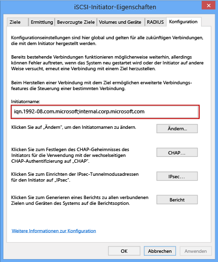

<!--author=SharS last changed: 9/17/15-->

#### So rufen Sie den IQN eines Windows Server-Hosts ab
1. Starten Sie den Microsoft iSCSI-Initiator auf dem Windows-Host. Klicken Sie auf **Start** > **Verwaltungstools** > **iSCSI-Initiator**.
2. Wählen Sie im Fenster **Eigenschaften des iSCSI-Initiators** auf der Registerkarte **Konfiguration** die Zeichenfolge im Feld **Initiatorname** aus, und kopieren Sie sie.
   
    
3. Speichern Sie diese Zeichenfolge.

