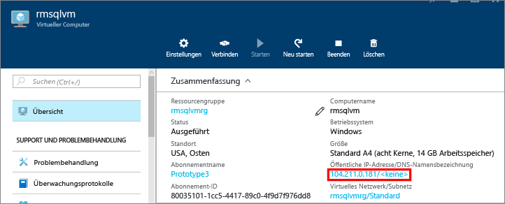
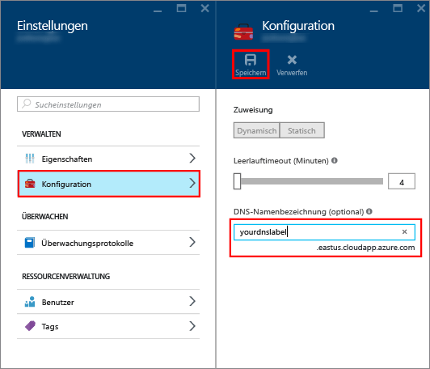
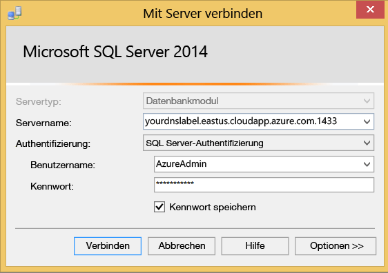

### Konfigurieren einer DNS-Bezeichnung für die öffentliche IP-Adresse

Um über das Internet eine Verbindung mit dem SQL Server-Datenbankmodul herzustellen, ziehen Sie die Konfiguration einer DNS-Bezeichnung für Ihre öffentliche IP-Adresse in Betracht. Sie können eine Verbindung über eine IP-Adresse herstellen, die DNS-Bezeichnung erstellt jedoch einen A-Datensatz, der einfacher zu identifizieren ist und die zugrunde liegende öffentliche IP-Adresse abstrahiert.

> [!NOTE]
> DNS-Bezeichnungen sind nicht erforderlich, wenn Sie nur eine Verbindung mit der SQL Server-Instanz im gleichen virtuellen Netzwerk oder nur eine lokale Verbindung herstellen möchten.

Wählen Sie zum Erstellen einer DNS-Bezeichnung als Erstes im Portal die Option **Virtuelle Computer** aus. Wählen Sie die SQL Server-VM aus, um deren Eigenschaften anzuzeigen.

1. Wählen Sie in der Übersicht für den virtuellen Computer Ihre **Öffentliche IP-Adresse**.

    

1. Erweitern Sie in den Eigenschaften für die öffentliche IP-Adresse die Option **Konfiguration**.

1. Geben Sie eine DNS-Bezeichnung ein. Hierbei handelt es sich um einen A-Eintrag, mit dem eine Verbindung mit Ihrer SQL Server-VM nach dem Namen anstatt direkt nach der IP-Adresse hergestellt werden kann.

1. Klicken Sie auf die Schaltfläche **Save** .

    

### Verbinden mit dem Datenbankmodul von einem anderen Computer aus

1. Öffnen Sie SQL Server Management Studio (SSMS) auf einem mit dem Internet verbundenen Computer. Falls Sie SQL Server Management Studio nicht haben, können Sie die Suite [hier](https://docs.microsoft.com/sql/ssms/download-sql-server-management-studio-ssms) herunterladen.

1. Bearbeiten Sie im Dialogfeld **Mit Server verbinden** oder **Verbindung mit Datenbankmodul herstellen** den Wert **Servername**. Geben Sie die IP-Adresse oder den vollständigen DNS-Namen des virtuellen Computers ein (in der vorherigen Aufgabe bestimmt). Sie können auch ein Komma einfügen und den TCP-Port von SQL Server angeben. Beispiel: `mysqlvmlabel.eastus.cloudapp.azure.com,1433`.

1. Wählen Sie im Feld **Authentifizierung** den Eintrag **SQL Server-Authentifizierung**.

1. Geben Sie im Feld **Anmelden** einen gültigen SQL-Anmeldenamen ein.

1. Geben Sie im Feld **Kennwort** das Kennwort für die Anmeldung ein.

1. Klicken Sie auf **Verbinden**.

    