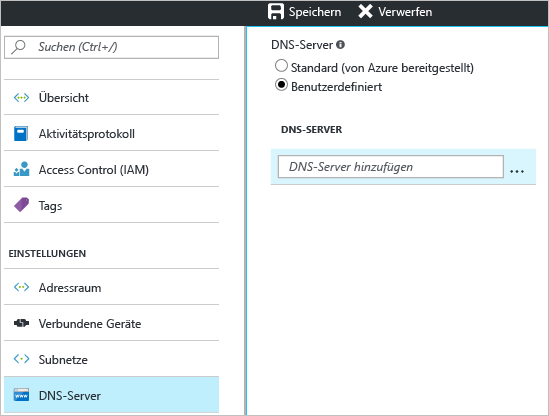

Diese Einstellung bietet die Möglichkeit, den DNS-Server anzugeben, den Sie zur Namensauflösung für dieses virtuelle Netzwerk verwenden möchten. Mit dieser Einstellung wird kein DNS-Server erstellt.

1. Wechseln Sie auf der Seite **Einstellungen** für Ihr virtuelles Netzwerk zu **DNS-Server**, und klicken Sie darauf, um das Blatt „DNS-Server“ zu öffnen.
2. Wählen Sie auf der Seite **DNS-Server** unter **DNS-Server** die Option **Benutzerdefiniert** aus.
3. Geben Sie im Feld **DNS-Server** im Feld **DNS-Server hinzufügen** die IP-Adresse des DNS-Servers ein, den Sie für die Namensauflösung verwenden möchten.
4. Klicken Sie, wenn Sie das Hinzufügen von DNS-Servern abgeschlossen haben, oben auf dem Blatt auf **Speichern**, um Ihre Konfiguration zu speichern.
   
    

<!--HONumber=Nov16_HO2-->

