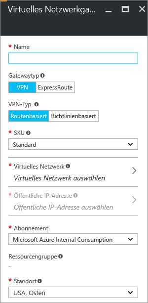

1. Navigieren Sie im Portal zu **Neu**. Geben Sie im Suchfeld die Zeichenfolge „Virtuelles Netzwerkgateway“ ein. Suchen Sie in der Ausgabe nach **Virtuelles Netzwerkgateway**, und klicken Sie auf den Eintrag. Das Blatt **Virtuelles Netzwerkgateway erstellen** wird geöffnet.
2. Klicken Sie am unteren Rand des Blatts **Virtuelles Netzwerkgateway** auf **Erstellen**. Das Blatt **Virtuelles Netzwerkgateway erstellen** wird geöffnet. Geben Sie die Werte für Ihr virtuelles Netzwerkgateway an.

	

3. **Name**: Benennen Sie Ihr Gateway. Dies ist nicht das Gleiche wie das Benennen eines Gatewaysubnetzes. Hierbei handelt es sich um den Namen des Gatewayobjekts, das Sie erstellen.

4. **Gatewaytyp**: Wählen Sie **VPN** aus. Bei VPN-Gateways wird ein virtuelles Netzwerkgateway vom Typ **VPN** verwendet.

5. **VPN-Typ**: Wählen Sie den für Ihre Konfiguration angegebenen VPN-Typ aus. Bei den meisten Konfigurationen wird ein routenbasierter VPN-Typ benötigt.

6. **SKU**: Wählen Sie in der Dropdownliste die Gateway-SKU aus. Welche SKUs in der Dropdownliste aufgeführt werden, hängt vom ausgewählten VPN-Typ ab.

7. **Standort**: Passen Sie das Feld **Standort** an, um auf den Standort zu verweisen, an dem sich das virtuelle Netzwerk befindet.
 
8. Wählen Sie das virtuelle Netzwerk aus, dem Sie dieses Gateway hinzufügen möchten. Klicken Sie auf **Virtuelles Netzwerk**, um das Blatt **Virtuelles Netzwerk auswählen** zu öffnen. Wählen Sie das VNet aus. Sollte Ihr VNet nicht angezeigt werden, vergewissern Sie sich, dass das Feld **Speicherort** auf die Region verweist, in dem sich Ihr virtuelles Netzwerk befindet.

9. Wählen Sie eine öffentliche IP-Adresse aus. Klicken Sie auf **Öffentliche IP-Adresse**, um das Blatt **Öffentliche IP-Adresse wählen** zu öffnen. Klicken Sie auf **+ Neu erstellen**, um das Blatt **Öffentliche IP-Adresse erstellen** zu öffnen. Geben Sie einen Namen für die öffentliche IP-Adresse ein. Dieses Blatt dient zum Erstellen eines öffentlichen IP-Adressobjekts, dem dynamisch eine öffentliche IP-Adresse zugewiesen wird. Klicken Sie auf **OK**, um Ihre Änderungen an diesem Blatt zu speichern.

10. **Abonnement**: Vergewissern Sie sich, dass das richtige Abonnement ausgewählt ist.

11. **Ressourcengruppe**: Diese Einstellung wird auf der Grundlage des ausgewählten virtuellen Netzwerks bestimmt.

12. Passen Sie den **Standort** nach Angabe der vorherigen Einstellungen nicht mehr an.

13. Überprüfen Sie die Einstellungen. Sie können die Option **An Dashboard anheften** unten auf dem Blatt auswählen, wenn das Gateway auf dem Dashboard angezeigt werden soll.

14. Klicken Sie auf **Erstellen**, um das Gateway zu erstellen. Die Einstellungen werden überprüft, und auf dem Dashboard wird die Kachel mit dem Hinweis angezeigt, dass das Gateway des virtuellen Netzwerks bereitgestellt wird. Die Erstellung eines Gateways kann bis zu 45 Minuten dauern. Unter Umständen müssen Sie die Portalseite aktualisieren, um den Status „Abgeschlossen“ anzuzeigen.

	

11. Nach der Erstellung des Gateways können Sie die zugewiesene IP-Adresse unter dem Virtual Network im Portal anzeigen. Das Gateway wird als verbundenes Gerät angezeigt. Sie können auf das verbundene Gerät (Ihr virtuelles Netzwerkgateway) klicken, um weitere Informationen anzuzeigen.

<!---HONumber=AcomDC_1005_2016-->