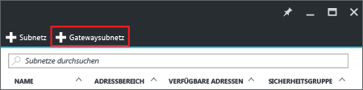
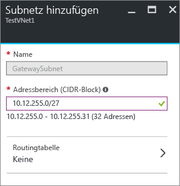

1. Navigieren Sie im Portal zu dem virtuellen Netzwerk, mit dem Sie ein Gateway verbinden möchten.
2. Klicken Sie auf dem VNet-Blatt im Abschnitt **Einstellungen** auf **Subnetze**, um das Blatt „Subnetze“ zu erweitern.
3. Klicken Sie auf dem Blatt **Subnetze** oben auf **+Gatewaysubnetz**. Dadurch wird das Blatt **Subnetz hinzufügen** geöffnet. 
   
    
4. Der **Name** für Ihr Subnetz wird automatisch mit dem Wert für „GatewaySubnet“ gefüllt. Dieser Wert ist erforderlich, damit Azure das Subnetz als Gatewaysubnetz erkennt. Passen Sie die automatisch ausgefüllten Werte für **Adressbereich** an Ihre Konfigurationsanforderungen an.
   
    
5. Klicken Sie unten auf dem Blatt auf **OK** , um das Subnetz zu erstellen.

<!--HONumber=Nov16_HO2-->

