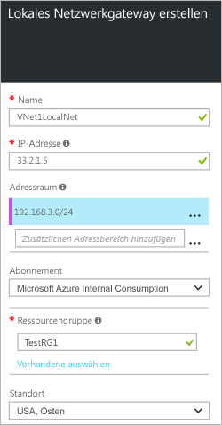

### Um ein lokales Netzwerkgateway zu erstellen, führen Sie die folgenden Schritte aus:

1. Navigieren Sie im Azure-Portal zu **Neu** **>** **Netzwerk** **>** **Lokales Netzwerkgateway**.

	

2. Geben Sie auf dem Blatt **Lokales Netzwerkgateway erstellen** unter **Name** einen Namen für das Objekt Ihres lokalen Netzwerkgateways ein.
 
3. Geben Sie eine **IP-Adresse** für das Gateway an. Dies ist die IP-Adresse des externen VPN-Geräts, mit dem Sie eine Verbindung herstellen möchten. Sie darf sich nicht hinter einer NAT befinden und muss für Azure erreichbar sein.

4. **Adressraum** bezieht sich auf die Adressbereiche für das lokale Netzwerk. Sie können mehrere Adressraumbereiche hinzufügen. Die hier eingegebenen Bereiche dürfen sich nicht mit den Adressraumbereichen für virtuelle Netzwerke überschneiden, die über das Gateway kommunizieren sollen. Sie müssen sie mit Ihrer lokalen Konfiguration sowie mit den Adressräumen des virtuellen Azure-Netzwerks koordinieren.
 
5. Stellen Sie unter **Abonnement** sicher, dass das richtige Abonnement angezeigt wird.

6. Wählen Sie unter **Ressourcengruppe** die Ressourcengruppe aus, die Sie verwenden möchten. Sie können entweder eine neue Ressourcengruppe erstellen oder eine auswählen, die Sie bereits erstellt haben. Um eine neue Ressourcengruppe zu erstellen, geben Sie den Namen in das Feld ein. Um eine bereits erstellte Ressourcengruppe auszuwählen, klicken Sie auf **Ressourcengruppe**, um das Blatt **Ressourcengruppe** zu öffnen, und wählen Sie dann die gewünschte Ressourcengruppe aus.

7. Wenn Sie ein neues Gateway für das lokale Netzwerk erstellen, können Sie für **Standort** denselben Standort verwenden wie für das Gateway des virtuellen Netzwerks. Dies ist jedoch nicht erforderlich. Das Gateway für das lokale Netzwerk kann sich an einem anderen Speicherort befinden.

8. Lassen Sie „An Dashboard anheften“ ausgewählt, wenn Sie dieses lokale Netzwerkgateway ganz bequem im Dashboard vorfinden möchten.

9. Klicken Sie auf **Erstellen**, um das Gateway für das lokale Netzwerk zu erstellen. Im Dashboard wird „Lokales Netzwerkgateway wird bereitgestellt“ angezeigt.

10. Wenn das Gateway des lokalen Netzwerks erstellt wurde, wird es im Portal zum Anzeigen geöffnet.

	

<!---HONumber=AcomDC_0406_2016-->