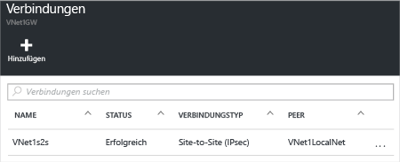

1. Suchen Sie das Gateway für Ihr virtuelles Netzwerk, und klicken Sie auf **Alle Einstellungen**, um das Blatt **Einstellungen** zu öffnen.

2. Klicken Sie auf dem Blatt **Einstellungen** auf **Verbindungen** und dann oben auf dem Blatt auf **Hinzufügen**, um das Blatt **Verbindung hinzufügen** zu öffnen.

	

3. Geben Sie auf dem Blatt **Verbindung hinzufügen** einen **Namen** für die Verbindung ein.

4. Wählen Sie als **Verbindungstyp** die Option **Standort-zu-Standort (IPSec)** aus.

5. Für **Virtuelles Netzwerkgateway** ist der Wert festgelegt, da Sie von diesem Gateway aus die Verbindung herstellen.

6. Klicken Sie unter **Lokales Netzwerkgateway** auf **Ein lokales Netzwerkgateway auswählen**, und wählen Sie das lokale Netzwerkgateway aus, das Sie verwenden möchten.

7. Unter **Gemeinsam verwendeter Schlüssel** muss der hier angegebene Wert mit dem Wert übereinstimmen, den Sie für Ihr lokales VPN-Gerät verwenden. Wenn Ihr VPN-Gerät im lokalen Netzwerk keinen gemeinsam verwendeten Schlüssel bereitstellt, können Sie einen erfinden und sowohl hier als auch auf Ihrem lokalen Gerät eingeben. Wichtig ist, dass beide übereinstimmen.

8. Die verbleibenden Werte für **Abonnement**, **Ressourcengruppe** und **Speicherort** sind unveränderlich.

9. Klicken Sie auf **OK**, um die Verbindung zu erstellen. Auf dem Bildschirm blinkt der Hinweis *Verbindung wird erstellt*.

10. Wenn die Verbindung erstellt ist, wird sie auf dem Blatt **Verbindungen** für Ihr Gateway angezeigt.

	

<!-----HONumber=AcomDC_0406_2016-->