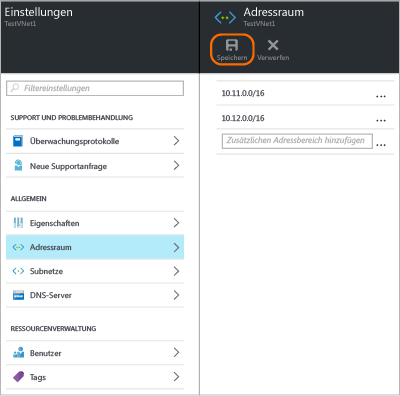

### So fügen Sie Adressraum hinzu

1. Klicken Sie zum Hinzufügen von zusätzlichem Adressraum auf **Alle Einstellungen**, um das Blatt **Einstellungen** zu öffnen. 

2. Klicken Sie auf dem Blatt **Einstellungen** auf **Adressraum**, um das Blatt „Adressraum“ zu öffnen. Fügen Sie den zusätzlichen Adressraum auf diesem Blatt hinzu, und klicken Sie dann oben auf dem Blatt auf **Speichern**.

	

### So fügen Sie Subnetze hinzu 

1. Klicken Sie zum Hinzufügen zusätzlicher Subnetze zu den Adressräumen auf dem Blatt **Einstellungen** auf **Subnetze**, um das Blatt **Subnetze** zu öffnen. 

2. Klicken Sie auf dem Blatt „Subnetze“ auf **Hinzufügen**, um das Blatt **Subnetz hinzufügen** zu öffnen. Geben Sie dem neuen Subnetz einen Namen, geben Sie den Adressbereich an, und klicken Sie unten auf dem Blatt auf **OK**. Nach dem Erstellen eines Subnetzes können Sie auf dem Blatt „Subnetze“ alle Subnetze für ein VNet anzeigen.

	

<!-----HONumber=AcomDC_0406_2016-->