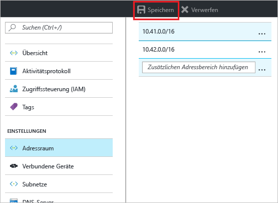
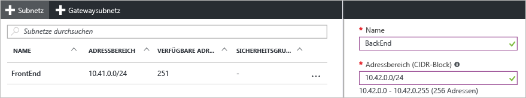

### So fügen Sie Adressraum hinzu
1. Wenn Sie zusätzlichen Adressraum hinzufügen möchten, klicken Sie unter dem Bereich **Einstellungen** auf dem Blatt Ihres virtuellen Netzwerks auf **Adressraum**, um das Blatt „Adressraum“ zu öffnen.
2. Fügen Sie den zusätzlichen Adressraum hinzu, und klicken Sie dann oben auf dem Blatt auf **Speichern**.
   
    

### So erstellen Sie Subnetze
1. Klicken Sie zum Erstellen von Subnetzen im Abschnitt **Einstellungen** auf dem Blatt für Ihr virtuelles Netzwerk auf **Subnetze**, um das Blatt **Subnetze** zu öffnen. 
2. Klicken Sie auf dem Blatt „Subnetze“ auf **+Subnetz**, um das Blatt **Subnetz hinzufügen** zu öffnen. Benennen Sie das neue Subnetz, und geben Sie den Adressbereich an.
   
            
3. Klicken Sie am unteren Rand des Blatts auf **OK**, um die vorgenommenen Änderungen zu speichern.
   
    

<!--HONumber=Nov16_HO2-->

