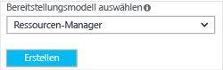
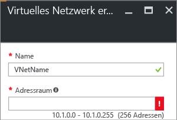

Führen Sie zum Erstellen eines VNet mit dem Azure-Portal die folgenden Schritte aus. Die Screenshots dienen als Beispiele. Achten Sie darauf, dass Sie die Werte durch Ihre eigenen Werte ersetzen. Weitere Informationen zur Arbeit mit virtuellen Netzwerken finden Sie unter [Virtuelle Netzwerke im Überblick](../articles/virtual-network/virtual-networks-overview.md).

1. Navigieren Sie in einem Browser zum [Azure-Portal](http://portal.azure.com) und melden Sie sich, falls erforderlich, mit Ihrem Azure-Konto an.
2. Klicken Sie auf **Neu**. Geben Sie im Feld **Marketplace durchsuchen** die Zeichenfolge „Virtuelles Netzwerk“ ein. Klicken Sie in der zurückgegebenen Liste auf **Virtuelles Netzwerk**, um das Blatt **Virtuelles Netzwerk** zu öffnen.
   
    
3. Wählen Sie unten auf dem Blatt „Virtuelles Netzwerk“ in der Liste **Bereitstellungsmodell auswählen** die Option **Resource Manager**, und klicken Sie dann auf **Erstellen**.

    

1. Konfigurieren Sie im Blatt **Virtuelles Netzwerk erstellen** die VNet-Einstellungen. Beim Ausfüllen der Felder verwandelt sich das rote Ausrufezeichen in ein grünes Häkchen, sofern die in das Feld eingegebenen Zeichen zulässig sind.
   
    
2. Das Blatt **Virtuelles Netzwerk erstellen** sieht in etwa wie im folgenden Beispiel aus. Unter Umständen wurden bestimmte Werte bereits automatisch ausgefüllt. Ersetzen Sie sie in diesem Fall durch Ihre eigenen Werte.
   
    
3. **Name**: Geben Sie den Namen für Ihr virtuelles Netzwerk ein.
4. **Adressraum**: Geben Sie den Adressraum ein. Falls Sie mehrere Adressräume hinzufügen möchten, fügen Sie Ihren ersten Adressraum hinzu. Weitere Adressräume können später (nach Erstellung des VNets) hinzugefügt werden.
5. **Subnetzname**: Fügen Sie Name und Adressbereich des Subnetzes hinzu. Weitere Subnetze können später (nach Erstellung des VNets) hinzugefügt werden.
6. **Abonnement**: Vergewissern Sie sich, dass das richtige Abonnement angegeben ist. Das Abonnement kann über die Dropdownliste geändert werden.
7. **Ressourcengruppe**: Wählen Sie entweder eine bereits vorhandene Ressourcengruppe aus, oder geben Sie einen Namen für eine neue Ressourcengruppe ein. Geben Sie der Ressourcengruppe beim Erstellen einer neuen Gruppe einen Namen, der zu Ihren geplanten Konfigurationswerten passt. Weitere Informationen zu Ressourcengruppen finden Sie unter [Übersicht über den Azure-Ressourcen-Manager](../articles/resource-group-overview.md#resource-groups).
8. **Standort**: Wählen Sie den Standort für Ihr VNet aus. Der Standort gibt an, wo sich die in diesem VNet bereitgestellten Ressourcen befinden.
9. Wählen Sie **An Dashboard anheften** aus, wenn das VNet komfortabel auf dem Dashboard zur Verfügung stehen soll, und klicken Sie dann auf **Erstellen**.
   
   
10. Nach dem Klicken auf **Erstellen** wird auf dem Dashboard eine Kachel angezeigt, die Aufschluss über den VNet-Status gibt. Die Kachel verändert sich, wenn das VNet erstellt wird.
    
    

<!---HONumber=AcomDC_1005_2016-->