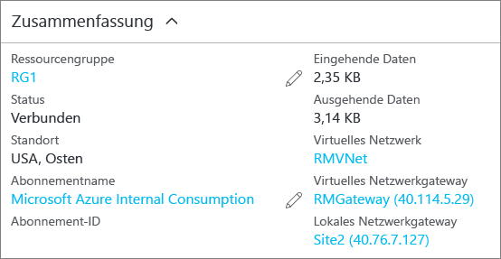

### <a name="to-verify-your-connection-by-using-powershell"></a>So überprüfen Sie Ihre Verbindung mithilfe von PowerShell

Sie können überprüfen, ob die Verbindungserstellung erfolgreich war, indem Sie das Cmdlet „Get-AzureRmVirtualNetworkGatewayConnection“ mit oder ohne den Zusatz „-Debug“ verwenden. 

1. Verwenden Sie das folgende Cmdlet-Beispiel, und konfigurieren Sie die Werte so, dass sie Ihren eigenen Werten entsprechen. Wählen Sie ggf. die Option „A“ für „Alle ausführen“ aus. In dem Beispiel verweist „-Name“ auf den Namen der Verbindung, die Sie erstellt haben und testen möchten.

  ```powershell
  Get-AzureRmVirtualNetworkGatewayConnection -Name MyGWConnection -ResourceGroupName MyRG
  ```
2. Sehen Sie sich nach Abschluss des Cmdlets die Werte an. Im Beispiel weiter unten ist der Verbindungsstatus als „Connected“ (Verbunden) angegeben, und Sie sehen die Eingangs- und Ausgangsbytes.

  ```
  "connectionType": "IPsec",
  "routingWeight": 10,
  "sharedKey": "abc123",
  "connectionStatus": "Connected",
  "ingressBytesTransferred": 33509044,
  "egressBytesTransferred": 4142431
  ```

### <a name="to-verify-your-connection-by-using-the-azure-portal"></a>So überprüfen Sie Ihre Verbindung mithilfe des Azure-Portals

Navigieren Sie im Azure-Portal zur gewünschten Verbindung, um den Verbindungsstatus anzuzeigen. Dazu gibt es verschiedene Möglichkeiten. Die folgenden Schritte zeigen eine Möglichkeit, zu Ihrer Verbindung zu navigieren und sie zu überprüfen.

1. Klicken Sie im [Azure-Portal](http://portal.azure.com) auf **All resources** (Alle Ressourcen), und navigieren Sie zu Ihrem Gateway für virtuelle Netzwerke.
2. Klicken Sie auf dem Blatt für das Gateway für virtuelle Netzwerke auf **Verbindungen**. Der Status der einzelnen Verbindungen wird angezeigt.
3. Klicken Sie auf den Namen der zu überprüfenden Verbindung, um **Zusammenfassung** zu öffnen. Unter „Zusammenfassung“ können Sie weitere Informationen zu Ihrer Verbindung anzeigen. Der **Status** lautet „Erfolgreich“ und „Verbunden“, wenn die Verbindung erfolgreich hergestellt wurde.
   
    